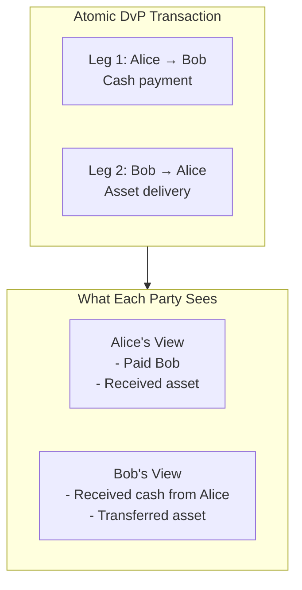
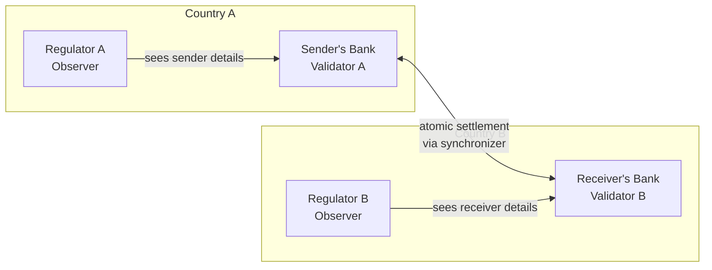
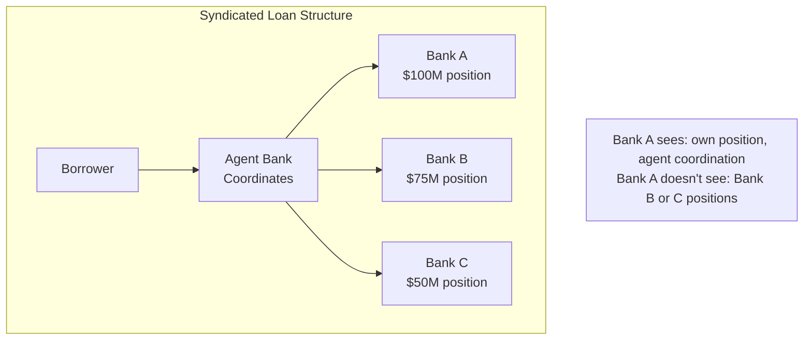

<Warning>
  이 페이지는 팀 리서치를 위한 비공식 한국어 번역입니다. 기술적 판단에는 [공식 영어 원문](https://docs.canton.network/overview/understand/use-cases.md)을 사용하세요.
</Warning>

import DamlOverviewUnderstandUseCasesL202 from "/snippets/daml-docs/overview_understand_use-cases_L202.mdx";
import DamlOverviewUnderstandUseCasesL77 from "/snippets/daml-docs/overview_understand_use-cases_L77.mdx";

Canton architecture는 public blockchain에서 실현하기 어려운 use case를 가능하게 합니다. 이 페이지에서는 주요 pattern과 구체적인 예제를 살펴봅니다.

## Delivery vs. Payment (DvP)

Canton capability의 대표적인 예제는 서로 다른 asset과 Party 간 atomic delivery vs. payment입니다.

### Scenario

Alice는 Bob에게 tokenized asset을 구매하고 private payment Synchronizer에서 settlement되는 tokenized cash instrument로 지불하려 합니다. Settlement는 다음 조건을 충족해야 합니다.

- **Atomic**: 두 leg가 모두 완료되거나 어느 쪽도 완료되지 않음
- **Private**: 관찰자가 Counterparty나 가격을 보지 못함

### 전통적인 Blockchain에서

다음 문제가 있습니다.

- 두 Transaction으로 처리하면 한쪽만 완료될 위험이 있음
- Atomically 처리하면 모든 Party와 관찰자가 거래의 모든 leg를 봄
- 누구나 가격과 조건을 볼 수 있음

### Canton에서

전체 exchange가 sub-transaction privacy를 적용한 하나의 atomic Transaction에서 일어납니다.

| Party | 보는 것 | 보지 못하는 것 |
|-------|---------|-----------------|
| **Alice** | 두 leg 모두, buyer이기 때문 | 해당 없음 |
| **Bob** | 두 leg 모두, seller이기 때문 | 해당 없음 |
| **제3자** | 아무것도 없음 | 이 거래의 모든 내용 |

<Note>
이 예제에서는 cash와 asset leg가 모두 거래 Participant만 Stakeholder인 Synchronizer에서 settlement된다고 가정합니다. 예를 들어 cash leg는 private payment Synchronizer에서, asset leg는 private securities Synchronizer에서 settlement됩니다. Global Synchronizer에서 settlement되는 asset이 포함된 거래는 다르게 작동합니다. Canton Coin transfer, Topology Transaction, network governance Transaction은 Global Synchronizer를 운영하는 Super Validator에 보이므로 같은 의미에서 private하지 않습니다. Dedicated Synchronizer는 완전한 sub-transaction privacy model을 유지합니다.
</Note>

### 이것이 중요한 이유

- **Regulatory compliance**: 각 Party는 자신에게 권한이 있는 정보만 봄
- **Atomic settlement**: 두 leg가 모두 완료되거나 어느 쪽도 완료되지 않아 settlement risk가 없음
- **Privacy**: Trading relationship과 가격 보호
- **Audit trail**: 권한 있는 auditor를 Observer로 추가 가능

## Tokenized Securities

Regulatory compliance가 내장된 securities를 발행하고 거래합니다.

### 요구 사항

- Issuer가 security 보유 가능 주체를 control함
- Regulator에 audit visibility가 있음
- 거래는 Buyer와 Seller 사이에서 private함
- Corporate action이 모든 holder에게 영향을 주지만 holding은 private하게 유지됨

### Canton 설계

<DamlOverviewUnderstandUseCasesL77 />

Regulator는 compliance를 위해 모든 holding을 observe하지만 해당 data는 public하지 않습니다. Issuer가 모든 transfer를 승인해야 하므로 자격 있는 Party만 security를 보유할 수 있습니다. 거래는 audit 가능성을 유지하면서도 Counterparty 사이에서 private하게 유지됩니다.

## Cross-Border Payment

Data sovereignty 요구 사항을 준수하면서 jurisdiction 간 value를 이동합니다.

### 과제

- Sender의 bank는 data localization 요구 사항이 있는 Country A에 있음
- Receiver의 bank는 요구 사항이 다른 Country B에 있음
- Correspondent banking에는 coordination이 필요함
- 어느 국가의 Regulator도 다른 국가의 customer data를 보아서는 안 됨

### Canton Solution

각 jurisdiction의 data는 해당 jurisdiction의 Validator에 유지됩니다.

- Sender의 detail은 Country A에 유지됨
- Receiver의 detail은 Country B에 유지됨
- Synchronizer 전체에서 settlement가 atomic함
- 각 Regulator는 자신의 jurisdiction data만 봄

## Syndicated Loan 관리

여러 bank가 서로의 position이나 term을 보지 않고 하나의 loan에 참여합니다.

### Scenario

Syndicated loan에서는 다음이 적용됩니다.
- 여러 bank가 같은 loan의 일부를 보유함
- 각 bank의 position은 confidential함
- Agent bank가 payment를 coordination함
- Borrower는 group 전체와 상호 작용함

Public system에서는 모든 Participant가 모든 position을 보게 되어 confidentiality가 무너집니다.

### Canton Solution

각 bank가 보는 내용:
- 자신의 position과 term
- 자신에게 들어오고 나가는 payment
- 자신이 보유한 부분에 대한 Agent coordination

각 bank가 보지 못하는 내용:
- 다른 bank의 position
- 다른 bank의 term
- 명시적으로 공유되지 않은 경우 전체 syndicate size

## Supply Chain Finance

Commercial relationship을 노출하지 않고 여러 Party 사이에서 goods와 payment를 추적합니다.

### Scenario

Manufacturer가 Distributor에 상품을 배송하고 Distributor가 Retailer에 배송합니다. 각 단계에서 financing이 제공됩니다.

### Privacy 요구 사항

- Manufacturer는 Retailer의 purchase price를 보아서는 안 됨
- Retailer는 manufacturing cost를 보아서는 안 됨
- 각 Financier는 자신이 financing한 debtor의 부분만 봄
- Logistics provider는 shipping information을 보지만 financial term은 보지 않음

### Canton 접근 방식

Canton의 privacy는 contract level에서 작동합니다. Observer는 개별 field가 아니라 contract 전체를 봅니다. 서로 다른 Party에 서로 다른 정보에 대한 access를 부여하려면 각 대상 audience를 위한 별도 contract를 설계합니다.

<DamlOverviewUnderstandUseCasesL202 />

하나의 atomic Transaction에서 두 contract를 모두 생성할 수 있습니다. Logistics provider와 Financier는 각자 관련 contract만 보는 반면, 두 contract 모두의 Signatory인 Shipper와 Receiver는 모든 내용을 봅니다. Supply chain의 downstream Participant는 upstream pricing을 절대 보지 못합니다. 그 contract의 Stakeholder가 다르기 때문입니다.

이처럼 audience별로 data를 서로 다른 contract에 분리하는 pattern을 통해 Canton은 atomicity를 유지하면서 fine-grained privacy를 달성합니다.

## Canton이 적합한 경우

Canton은 다음이 필요할 때 적합합니다.

| 요구 사항 | Canton이 제공하는 것 |
|-----------|----------------------|
| **Multi-party coordination** | 명시적인 authorization이 있는 native multi-party contract |
| **Confidential execution** | 설계에 내장된 sub-transaction privacy |
| **Regulatory compliance** | Authorize된 Party에 대한 selective disclosure |
| **Atomic settlement** | Party 전체에 걸친 all-or-nothing execution |
| **Audit trail** | 권한 있는 auditor를 위한 Observer 역할 |

## Canton이 적합하지 않을 수 있는 경우

다음이 필요하다면 다른 대안을 고려하세요.

| 요구 사항 | 고려 사항 |
|-----------|-----------|
| **완전한 public application** | Transparency가 제약이 아니라 기능인 경우, 예: public governance, open auction |
| **EVM compatibility** | Canton은 Ethereum smart contract와 native interoperability를 제공하지 않음 |
| **Anonymous participation** | Canton Party에는 identity가 있으므로 완전히 anonymous한 system에는 다른 접근 방식이 필요함 |
| **단순한 single-party app** | Blockchain overhead가 정당화되지 않을 수 있음 |

## 다음 단계

<CardGroup cols={2}>

<Card title="핵심 개념" icon="book" href="/overview/understand/core-concepts">
  Party, Validator, Synchronizer를 이해합니다.
</Card>

<Card title="개발 시작" icon="code" href="/appdev/get-started/choose-your-path">
  개발 여정을 시작합니다.
</Card>

</CardGroup>
