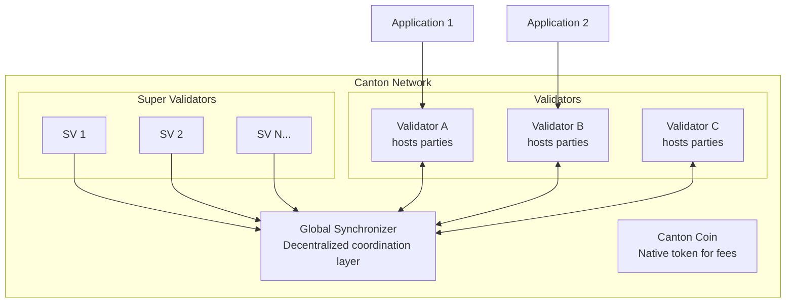

<Warning>
  이 페이지는 팀 리서치를 위한 비공식 한글 번역입니다. 기술적 판단에는 [공식 영어 원문](https://docs.canton.network/overview/understand/what-is-canton)을 사용하세요.
</Warning>

Canton Network는 privacy-preserving transaction을 위해 설계된 public Layer 1 blockchain입니다. 모든 transaction이 모든 participant에게 공개되는 전통적인 blockchain과 달리, Canton은 선택적 공개를 지원하므로 Party는 자신에게 권한이 있는 데이터만 볼 수 있습니다.

## 60초 요약

Canton Network는 blockchain의 근본적인 긴장 관계인 **투명성과 privacy** 문제를 해결합니다. Ethereum 같은 전통적인 blockchain은 integrity와 decentralization을 제공하지만 모든 transaction 데이터를 전체 network participant에게 공개합니다. 따라서 규제 금융 시장, 기밀 업무 과정, 데이터 privacy가 필수인 application에는 적합하지 않을 수 있습니다.

Canton은 다음을 제공합니다.

- **Sub-transaction privacy**: 동일한 transaction에 참여하는 각 Party는 자신과 관련된 부분만 확인합니다.
- **Decentralized consensus**: 하나의 주체가 network 전체를 통제하지 않습니다.
- **Regulatory compliance**: 데이터는 해당 데이터를 소유한 Party에게 유지됩니다.
- **Horizontal scalability**: global state replication 없이 node를 추가해 확장할 수 있습니다.

## Canton이 해결하는 문제

간단한 사례를 생각해 보겠습니다. Alice가 Bob과 자산을 거래하려고 합니다. Ethereum에서는 이 거래가 모두에게 공개되므로 Charlie, Dave와 수많은 익명 관찰자가 가격, 거래 Party, 자산 세부 정보를 확인할 수 있습니다.

규제 금융에서는 이를 수용하기 어렵습니다. 포지션 공개는 front-running 가능성을 만들고 transaction pattern은 거래 전략을 노출합니다. Compliance requirement에 따라 특정 데이터를 권한 없는 Party와 공유하는 것이 금지될 수도 있습니다.

Canton은 데이터가 어디에 배포되는지를 근본적으로 변경합니다. 대부분의 blockchain에서는 모든 state와 transaction이 모든 node에 복제됩니다. Canton에서는 smart contract에 지정된 node에만 state와 transaction이 배포됩니다. 이는 추가로 붙인 privacy layer가 아니라 핵심 architecture 원칙입니다.

## Canton의 차이점

Canton은 다른 blockchain platform과 세 가지 핵심 측면에서 다릅니다.

### Sub-Transaction Privacy

다른 blockchain이 privacy를 별도 기능으로 추가하는 것과 달리 Canton은 protocol layer에 privacy를 포함합니다. Transaction은 여러 view로 분해되며 각 Party는 자신에게 해당하는 부분만 확인합니다.

### Synchronizer와 Global Consensus

Canton은 모든 node가 복제하는 하나의 blockchain을 사용하지 않습니다. 대신 **Synchronizer**가 state를 저장하지 않으면서 consensus를 조정하고, **Participant Node**인 Validator는 자신이 hosting하는 Party와 관련된 데이터만 받아 저장합니다.

### Daml Smart Contract

Canton은 다자간 workflow를 위해 설계된 Daml을 사용합니다. Solidity의 imperative model과 달리 Daml은 다음을 제공합니다.

- 명시적인 authorization 선언: 누가 무엇을 할 수 있는가
- 내장된 privacy control: 누가 무엇을 볼 수 있는가
- Immutable contract: state 변경 시 새로운 contract 생성

## Canton Network Ecosystem

**핵심 component:**

- **Global Synchronizer**: Super Validator가 운영하는 public coordination layer
- **Canton Coin (CC)**: transaction fee와 Validator reward에 사용되는 native utility token
- **Validator**: Party를 hosting하고 해당 contract data를 저장하는 Participant Node
- **Application**: Ledger API를 통해 Validator에 연결되는 개발 대상

## Canton 사용자

Canton Network는 2023년 5월 출시됐으며 banking, market infrastructure, trading 분야의 주요 금융 기관이 참여했습니다. 현재 participant 목록은 [Canton Network website](https://www.canton.network/)에서 확인할 수 있습니다.

이러한 기관 참여는 enterprise use case에 대한 Canton 접근 방식을 뒷받침하지만, platform이 직접적인 지원 관계를 가진 enterprise developer를 중심으로 발전했다는 의미도 있습니다. Global Synchronizer 출시 이후 Canton은 금융 infrastructure를 개발하는 누구에게나 접근 가능한 형태가 되었습니다.

## Canton을 사용하기 적합한 경우

### 적합한 Use Case

| Use Case | Canton이 적합한 이유 |
|----------|----------------------|
| **기밀성이 필요한 다자간 workflow** | Participant가 서로의 position을 보지 않아야 하는 경우, 예: syndicated loan, trade finance |
| **규제 자산 tokenization** | Compliance를 위해 data sovereignty가 필요한 경우, 예: securities, real estate |
| **조직 간 process** | 모든 정보를 공개하지 않고 shared state가 필요한 경우, 예: supply chain, consortium application |
| **Privacy-preserving DeFi** | Position과 portfolio를 비공개로 유지해야 하는 경우, 예: trading, lending |

### 상대적으로 적합하지 않은 Use Case

| Use Case | Canton이 적합하지 않을 수 있는 이유 |
|----------|--------------------------------------|
| **완전히 공개된 application** | Transparency 자체가 필요한 기능인 경우, 예: public governance, open auction |
| **단순한 단일 Party application** | Distributed ledger 특성에서 얻는 이점이 없는 경우 |
| **EVM interoperability가 필수인 경우** | Canton은 Ethereum smart contract와 기본적으로 상호 운용되지 않음 |
| **익명 public participation** | Canton Party에는 identity가 있으므로 완전한 익명 system에는 다른 접근 방식이 필요함 |

## 다음 단계

- **[Blockchain Developer를 위한 Canton](/appdev/modules/m2-canton-for-ethereum-devs)**: 기존 blockchain 지식을 Canton 개념에 연결합니다.
- **[Architecture Overview](/overview/learn/architecture)**: Canton component의 상호작용을 이해합니다.
- **[Privacy Model Explained](/overview/learn/privacy-model)**: Sub-transaction privacy를 자세히 살펴봅니다.
