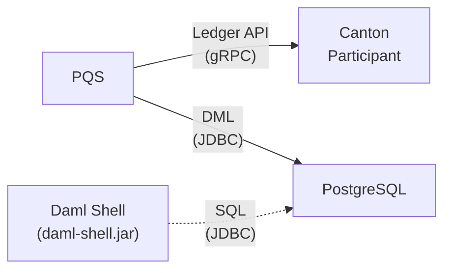

<Warning>
  이 페이지는 팀 리서치를 위한 비공식 한글 번역입니다. [공식 영어 원문](https://docs.canton.network/sdks-tools/cli-tools/daml-shell.md)을 함께 확인하세요.
</Warning>

import ExternalDamlShellMainDamlShellRstCodeDocsUserComponentHowtosDamlShellIndexSh138 from "/snippets/external/daml-shell/main/daml-shell-rst-code-docs-user-component-howtos-daml-shell-index-sh-138.mdx";
import ExternalDamlShellMainDamlShellRstCodeDocsUserComponentHowtosDamlShellIndexSh171 from "/snippets/external/daml-shell/main/daml-shell-rst-code-docs-user-component-howtos-daml-shell-index-sh-171.mdx";
import ExternalDamlShellMainDamlShellRstCodeDocsUserComponentHowtosDamlShellIndexText387 from "/snippets/external/daml-shell/main/daml-shell-rst-code-docs-user-component-howtos-daml-shell-index-text-387.mdx";
import ExternalDamlShellMainDamlShellRstCodeDocsUserComponentHowtosDamlShellIndexText394 from "/snippets/external/daml-shell/main/daml-shell-rst-code-docs-user-component-howtos-daml-shell-index-text-394.mdx";
import ExternalDamlShellMainDamlShellRstCodeDocsUserSdlcHowtosApplicationsDevelopDebugDamlShellIndexText16 from "/snippets/external/daml-shell/main/daml-shell-rst-code-docs-user-sdlc-howtos-applications-develop-debug-daml-shell-index-text-16.mdx";
import ExternalDamlShellMainDamlShellRstCodeDocsUserSdlcHowtosApplicationsDevelopDebugDamlShellIndexText27 from "/snippets/external/daml-shell/main/daml-shell-rst-code-docs-user-sdlc-howtos-applications-develop-debug-daml-shell-index-text-27.mdx";
import ExternalDamlShellMainDamlShellRstCodeDocsUserSdlcHowtosApplicationsDevelopDebugDamlShellIndexText58 from "/snippets/external/daml-shell/main/daml-shell-rst-code-docs-user-sdlc-howtos-applications-develop-debug-daml-shell-index-text-58.mdx";
import ExternalDamlShellMainDamlShellRstCodeDocsUserSdlcHowtosApplicationsDevelopDebugDamlShellIndexText74 from "/snippets/external/daml-shell/main/daml-shell-rst-code-docs-user-sdlc-howtos-applications-develop-debug-daml-shell-index-text-74.mdx";
import ExternalDamlShellMainDamlShellRstCodeDocsUserSdlcHowtosApplicationsDevelopDebugDamlShellIndexText98 from "/snippets/external/daml-shell/main/daml-shell-rst-code-docs-user-sdlc-howtos-applications-develop-debug-daml-shell-index-text-98.mdx";
import ExternalDamlShellMainDamlShellRstCodeDocsUserSdlcHowtosApplicationsDevelopDebugDamlShellIndexText104 from "/snippets/external/daml-shell/main/daml-shell-rst-code-docs-user-sdlc-howtos-applications-develop-debug-daml-shell-index-text-104.mdx";
import ExternalDamlShellMainDamlShellRstCodeDocsUserSdlcHowtosApplicationsDevelopDebugDamlShellIndexText127 from "/snippets/external/daml-shell/main/daml-shell-rst-code-docs-user-sdlc-howtos-applications-develop-debug-daml-shell-index-text-127.mdx";
import ExternalDamlShellMainDamlShellRstCodeDocsUserSdlcHowtosApplicationsDevelopDebugDamlShellIndexText189 from "/snippets/external/daml-shell/main/daml-shell-rst-code-docs-user-sdlc-howtos-applications-develop-debug-daml-shell-index-text-189.mdx";
import ExternalDamlShellMainDamlShellRstCodeDocsUserSdlcHowtosApplicationsDevelopDebugDamlShellIndexText204 from "/snippets/external/daml-shell/main/daml-shell-rst-code-docs-user-sdlc-howtos-applications-develop-debug-daml-shell-index-text-204.mdx";
import ExternalDamlShellMainDamlShellRstCodeDocsUserSdlcHowtosApplicationsDevelopDebugDamlShellIndexText237 from "/snippets/external/daml-shell/main/daml-shell-rst-code-docs-user-sdlc-howtos-applications-develop-debug-daml-shell-index-text-237.mdx";
import ExternalDamlShellMainDamlShellRstCodeDocsUserSdlcHowtosApplicationsDevelopDebugDamlShellIndexText309 from "/snippets/external/daml-shell/main/daml-shell-rst-code-docs-user-sdlc-howtos-applications-develop-debug-daml-shell-index-text-309.mdx";
import ExternalDamlShellMainDamlShellRstCodeDocsUserSdlcHowtosApplicationsDevelopDebugDamlShellIndexText317 from "/snippets/external/daml-shell/main/daml-shell-rst-code-docs-user-sdlc-howtos-applications-develop-debug-daml-shell-index-text-317.mdx";
import ExternalDamlShellMainDamlShellRstCodeDocsUserSdlcHowtosApplicationsDevelopDebugDamlShellIndexText325 from "/snippets/external/daml-shell/main/daml-shell-rst-code-docs-user-sdlc-howtos-applications-develop-debug-daml-shell-index-text-325.mdx";
import ExternalDamlShellMainDamlShellRstCodeDocsUserSdlcHowtosApplicationsDevelopDebugDamlShellIndexText334 from "/snippets/external/daml-shell/main/daml-shell-rst-code-docs-user-sdlc-howtos-applications-develop-debug-daml-shell-index-text-334.mdx";
import ExternalDamlShellMainDamlShellRstCodeDocsUserSdlcHowtosApplicationsDevelopDebugDamlShellIndexText364 from "/snippets/external/daml-shell/main/daml-shell-rst-code-docs-user-sdlc-howtos-applications-develop-debug-daml-shell-index-text-364.mdx";
import ExternalDamlShellMainDamlShellRstCodeDocsUserSdlcHowtosApplicationsDevelopDebugDamlShellIndexText370 from "/snippets/external/daml-shell/main/daml-shell-rst-code-docs-user-sdlc-howtos-applications-develop-debug-daml-shell-index-text-370.mdx";

{/* COPIED_START source="daml-shell:docs/user/component-howtos/daml-shell/index.rst" hash="f2fcc9ff" */}

# Daml Shell

Daml Shell은 Participant Query Store인 `PQS` PostgreSQL database에 저장된 Ledger data를 interactive하게 query하는 component입니다.

## Overview

Daml Shell은 active PQS deployment가 PostgreSQL database에 저장한 Ledger transaction과 관련 event, 즉 create/exercise/archive를 query해 Ledger의 현재/history state를 검사하는 interactive terminal session을 제공합니다.

Daml Shell로 다음 작업을 수행할 수 있습니다.

- 특정 Contract를 찾아 표시합니다. Contract ID가 있으면 `contract` command로 해당 Contract를 검사할 수 있습니다.
- Transaction ID와 관련된 모든 event를 찾습니다. Transaction은 create, archive, exercise로 구성된 Ledger event series로 표시됩니다.
- Contract ID, fully qualified name, Package name 같은 identifier를 auto-complete합니다.
- Template FQN으로 active/inactive/all Contract를 나열합니다.
- Command에 query/filter를 적용해 output을 관리합니다.
- `compare-contracts` command로 같은 Template의 두 Contract ID 사이 delta를 강조합니다.
- Offset value 범위를 query합니다.

아래 diagram은 Canton Ledger 전체 architecture에서 Daml Shell의 위치와 PQS database와의 상호작용을 보여줍니다.



### Compatibility

Daml Shell은 여러 PQS version과 compatible합니다.

| Dependency               | Versions   |
|--------------------------|------------|
| PQS                      | \>= 0.6.12 |
| postgres-document.schema | \>= 033    |

## Download

Daml Shell은 Java `jar` file과 `Docker` container image로 제공됩니다.

| Source          | Location                                                                                        |
|-----------------|-------------------------------------------------------------------------------------------------|
| Browse UI       | [https://console.cloud.google.com/artifacts/docker/da-images/europe/public/docker%2Fdaml-shell](https://console.cloud.google.com/artifacts/docker/da-images/europe/public/docker%2Fdaml-shell) |
| Docker Registry | `europe-docker.pkg.dev/da-images/public/docker/daml-shell`                                      |

## Configure

Daml Shell은 다음 source에서 우선순위 순으로 configuration을 가져옵니다.

1.  HOCON configuration file, `--config` argument
2.  Command-line argument
3.  Java system property, `java` command의 `-D` argument
4.  Environment variable
5.  실행 후 `set` command를 통한 interactive 설정

<Note>
Daml Shell configuration은 startup 시 읽지만 많은 value를 interactive하게 조정할 수 있습니다. `build_daml_shell_interactive_configuration` section을 참조하세요.
</Note>

사용 가능한 모든 configuration option은 `build_daml_shell_configuration_options`를 참조하세요.

## Security

Daml Shell은 PostgreSQL database client이므로 해당 service의 TLS/authentication security setting을 준수해야 합니다.

### TLS

PostgreSQL 같은 server-side component가 TLS 사용을 요구할 수 있습니다. 설정 방법은 해당 문서를 참조하세요.

- PostgreSQL은 각주 문서[^1]를 참조하세요.

설정 후 전용 parameter에 적절한 value를 사용합니다.

``` text
$ ./daml-shell.jar \
     --postgres-tls-cert /path/to/postgres.crt \
     --postgres-tls-key /path/to/postgres.der \
     --postgres-tls-cafile /path/to/postgres.crt \
     --postgres-tls-mode VerifyFull
```

## Operate

### Prerequisite

Daml Shell 실행에는 다음이 필요합니다.

> - Data가 채워진 PostgreSQL database를 가진 PQS deployment
> - Daml Shell application JAR 또는 Docker image

### Daml Shell 실행

Daml Shell은 interactive client이며 PQS database가 필요합니다.

Download한 `jar` file로 Daml Shell을 시작합니다.

<ExternalDamlShellMainDamlShellRstCodeDocsUserComponentHowtosDamlShellIndexSh138 />

<Note>
`.jar` artifact를 실행하려면 host에 Java Runtime Environment 17 이상이 설치되어 있어야 합니다.
</Note>

#### Docker image 고려사항

Daml Shell은 interactive terminal application이므로 TTY가 필요합니다. `docker run` command에 interactive argument `-i`/`--interactive`와 TTY argument `-t`/`--tty`를 설정하세요.

``` sh
$ docker run --interactive --tty \
    europe-docker.pkg.dev/da-images/public/docker/daml-shell:<version-tag>;
```

<Note>
Docker Compose나 Kubernetes 같은 container orchestration tool을 사용한다면 Daml Shell의 TTY/interactivity 활성화 방법을 해당 문서에서 확인하세요.
</Note>

### 도움말

Configuration option은 `--help` argument로 가장 쉽게 살펴볼 수 있습니다.

<ExternalDamlShellMainDamlShellRstCodeDocsUserComponentHowtosDamlShellIndexSh171 />

## Troubleshooting

### Archived Contract가 보이지 않는 이유

Archived Contract가 보이지 않는다면 PQS가 historical event를 포함하지 않는 latest ACS에서 database를 seed하도록 설정되었을 수 있습니다.

기존 archived Contract를 보려면 `Transaction Stream` 또는 `Transaction Tree Stream`에서 database를 seed합니다.

가능한 많은 history를 ingest하려면 PQS를 처음 실행할 때 `--pipeline-ledger-start`를 `Genesis`로 설정합니다. PQS 문서를 참조하세요.

### Choice가 보이지 않는 이유

Choice는 Ledger API의 `Transaction Tree Stream`에서만 보입니다. PQS 실행 시 `--pipeline-datasource`를 `TransactionTreeStream`으로 설정하고 PQS 문서를 참조하세요.

Choice가 여전히 보이지 않으면 `build_daml_shell_no_archived_contracts`를 참조하세요.

### Interface View가 보이지 않는 이유

Interface는 Ledger API의 `Transaction Stream` 또는 ACS에서만 보이며 `Transaction Tree Stream`에서는 보이지 않습니다.

PQS 실행 시 `--pipeline-datasource`를 `TransactionStream`으로 설정하고 PQS 문서를 참조하세요.

### 모든 Contract가 같은 Ledger offset을 표시하는 이유

`build_daml_shell_no_archived_contracts`를 참조하세요.

## Contribute

질문과 feature request는 [Canton Forum](https://forum.canton.network/)에 올리세요.

## Reference

### Configuration option

`./daml-shell.jar` parameters

| Parameter | Description |
|-----------|-------------|
| `--config <file>` | External HOCON file로 configuration을 override하는 path입니다. 선택 사항입니다. Environment variable: `DAML_SHELL_CONFIG`. System property: `config`. |
| `--wildcard-char <char>` | Identifier 축약에 사용하는 wildcard character이며 default는 `…`입니다. Environment variable: `DAML_SHELL_WILDCARD_CHAR`. System property: `wildcard-char`. |
| `--identifier-hash-length <length>` | Identifier 내부 hash를 표시할 character 수이며 default는 `20`입니다. Environment variable: `DAML_SHELL_IDENTIFIER_HASH_LENGTH`. System property: `identifier-hash-length`. |
| `--full-identifiers` | Identifier 축약을 비활성화합니다. Environment variable: `DAML_SHELL_FULL_INDENTIFIERS`. System property: `full-identifiers`. |
| `--identifier-trim-location <enum>` | 긴 identifier를 trim할 위치이며 default는 `trailing`입니다. Environment variable: `DAML_SHELL_IDENTIFIER_TRIM_LOCATION`. System property: `identifier-trim-location`. Enum: `leading`, `middle`, `trailing`. |
| `--completion-query-items <count>` | Prompt 없이 표시할 completion 수이며 default는 `100`입니다. Environment variable: `DAML_SHELL_COMPLETION_QUERY_ITEMS`. System property: `completion-query-items`. |
| `--disable-color` | ANSI color output을 비활성화합니다. Environment variable: `DAML_SHELL_DISABLE_COLOR`. System property: `disable-color`. |
| `--postgres-host <host>` | 연결할 Postgres host이며 default는 `localhost`입니다. `--connect`를 imply합니다. Environment variable: `DAML_SHELL_POSTGRES_HOST`. System property: `postgres-host`. |
| `--postgres-port <port>` | 연결할 Postgres port이며 default는 `5432`입니다. `--connect`를 imply합니다. Environment variable: `DAML_SHELL_POSTGRES_PORT`. System property: `postgres-port`. |
| `--postgres-username <username>` | Postgres username이며 default는 `postgres`입니다. `--connect`를 imply합니다. Environment variable: `DAML_SHELL_POSTGRES_USERNAME`. System property: `postgres-username`. |
| `--postgres-password <password>` | Postgres password이며 default는 `none`입니다. `--connect`를 imply합니다. Environment variable: `DAML_SHELL_POSTGRES_PASSWORD`. System property: `postgres-password`. |
| `--postgres-database <name>` | 연결할 Postgres database이며 default는 `postgres`입니다. `--connect`를 imply합니다. Environment variable: `DAML_SHELL_POSTGRES_DATABASE`. System property: `postgres-database`. |
| `--postgres-schema <name>` | 연결할 Postgres schema이며 default는 `public`입니다. `--connect`를 imply합니다. Environment variable: `DAML_SHELL_POSTGRES_SCHEMA`. System property: `postgres-schema`. |
| `--postgres-tls-mode <enum>` | Postgres connection TLS mode이며 default는 `Disable`입니다. `--connect`를 imply합니다. Environment variable: `DAML_SHELL_POSTGRES_TLS_MODE`. System property: `postgres-tls-mode`. Enum: `Disable`, `VerifyCA`, `VerifyFull`, `Require`. |
| `--postgres-tls-cafile <path>` | Postgres connection의 TLS CA file path이며 default는 `none`입니다. Environment variable: `DAML_SHELL_POSTGRES_TLS_CAFILE`. System property: `postgres-tls-cafile`. |
| `--postgres-tls-cert <path>` | Postgres connection의 TLS certificate file path이며 default는 `none`입니다. Environment variable: `DAML_SHELL_POSTGRES_TLS_CERT`. System property: `postgres-tls-cert`. |
| `--postgres-tls-key <path>` | Postgres connection의 TLS key file path이며 default는 `none`입니다. Environment variable: `DAML_SHELL_POSTGRES_TLS_KEY`. System property: `postgres-tls-key`. |
| `--connect` | Startup 시 database에 자동 연결합니다. Environment variable: `DAML_SHELL_CONNECT`. System property: `connect`. |

### Interactive configuration

Daml Shell 시작 후 `set` command로 configuration value를 interactive하게 설정/조정할 수 있습니다.

Identifier hash length를 변경합니다.

<ExternalDamlShellMainDamlShellRstCodeDocsUserComponentHowtosDamlShellIndexText387 />

특정 setting을 자세히 알아보려면 `help set`을 입력합니다.

<ExternalDamlShellMainDamlShellRstCodeDocsUserComponentHowtosDamlShellIndexText394 />

[^1]: `https://www.postgresql.org/docs/current/ssl-tcp.html`

{/* COPIED_END */}

{/* COPIED_START source="daml-shell:docs/user/sdlc-howtos/applications/develop/debug/daml-shell/index.rst" hash="d6b9b545" */}

# Daml Shell로 Ledger 검사

## PQS datastore 연결

Daml Shell은 실행 중인 Participant Query Store service가 data를 적재한 PostgreSQL database에 JDBC로 연결합니다.

Connection parameter는 runtime에 configuration file, command line argument, environment variable로 설정하거나 JDBC URL을 사용해 interactive하게 설정할 수 있습니다.

<ExternalDamlShellMainDamlShellRstCodeDocsUserSdlcHowtosApplicationsDevelopDebugDamlShellIndexText16 />

Daml Shell configuration 방법은 `build_daml_shell_configuration_options`를 참조하세요.

Interactive하게 연결하려면 `connect` command를 사용하고 PQS PostgreSQL database의 JDBC URL을 입력합니다.

<ExternalDamlShellMainDamlShellRstCodeDocsUserSdlcHowtosApplicationsDevelopDebugDamlShellIndexText27 />

Status bar는 connection status, session offset range, datastore offset range를 보여줍니다.


## Contract data query

Daml Shell은 Ledger data를 여러 방식으로 query할 수 있습니다.

### Offset 기준 query

Default로 offset의 leading zero가 제거됩니다. Contract ID hash를 포함한 모든 identifier를 전체로 보려면 `set identifier-hash-length full`을 실행합니다. `set identifier-hash-length 15`처럼 custom hash length limit도 설정할 수 있습니다.

Ledger implementation에 따라 offset이 hexadecimal format일 수 있습니다.

Datastore에서 사용 가능한 offset range는 `Datastore range` status field에 표시됩니다. Daml Shell이 payload count/summary를 표시하는 데 사용할 offset range는 `Session range` status field에 표시됩니다.

`set latest` alias인 `go` command로 다른 offset으로 이동할 수 있습니다. 두 offset 뒤로 가는 `go -2`, 두 offset 앞으로 가는 `go +2`, `go next` alias인 `go forward`, `go backward` alias인 `go back`, `go start`, `go end`가 유효한 command example입니다.

`net-changes` command는 현재 offset의 transaction이 만든 change를 요약합니다. Target `offset` argument 하나 또는 비교할 `offset` argument 두 개도 받습니다. `help net-changes`를 참조하세요.

<ExternalDamlShellMainDamlShellRstCodeDocsUserSdlcHowtosApplicationsDevelopDebugDamlShellIndexText58 />


#### Contract summary

`active`, `archives`, `creates`, `exercises` 같은 command를 argument 없이 사용하면 fully qualified identifier name별 payload count를 볼 수 있습니다. 자세한 내용은 help를 실행하세요.

<ExternalDamlShellMainDamlShellRstCodeDocsUserSdlcHowtosApplicationsDevelopDebugDamlShellIndexText74 />


#### Fully qualified name별 payload

`active`, `archives`, `creates`, `exercises` command에 fully qualified name, 즉 FQN을 지정해 해당 FQN의 모든 applicable payload를 나열합니다.

특정 Package의 payload만 반환하려면 FQN에 Package name을 포함합니다.

<ExternalDamlShellMainDamlShellRstCodeDocsUserSdlcHowtosApplicationsDevelopDebugDamlShellIndexText98 />

Package name을 생략하면 동일한 name을 가진 모든 Package의 payload가 반환됩니다.

<ExternalDamlShellMainDamlShellRstCodeDocsUserSdlcHowtosApplicationsDevelopDebugDamlShellIndexText104 />

Auto-completion은 Package name 포함/미포함 FQN variant를 모두 제공합니다.

#### ID로 Contract 조회

Contract ID로 Contract를 조회할 수 있습니다. Interface View가 있으면 함께 표시됩니다.

Wildcard character인 "…"를 포함해 Contract ID를 copy할 수 있습니다. Wildcard character는 일치하는 ID로 expand됩니다.

<ExternalDamlShellMainDamlShellRstCodeDocsUserSdlcHowtosApplicationsDevelopDebugDamlShellIndexText127 />

`compare-contracts <id1> <id2>` command로 두 Contract를 `diff` style output format으로 비교할 수도 있습니다.


#### Transaction ID 조회

각각 `transaction` 또는 `transaction at`을 실행해 Transaction ID나 offset으로 transaction을 조회할 수 있습니다. Offset 조회 시 `at` syntax에 유의하세요.

Session offset range의 head에 있는 현재 transaction을 표시하려면 `transaction`을 실행합니다.

`transaction` command는 생성/archive된 Contract와 exercise된 Choice를 보여줍니다. 각 event의 Event ID, Contract ID, Package name도 표시합니다.


#### Exercise 조회

Exercised Choice는 Contract와 같은 방식으로 조회하지만 Contract ID 대신 Event ID를 사용합니다. Summary와 lookup command는 Contract에서 제공하는 기능과 대응합니다.

예를 들어 FQN별 exercise count를 조회할 수 있습니다.

<ExternalDamlShellMainDamlShellRstCodeDocsUserSdlcHowtosApplicationsDevelopDebugDamlShellIndexText189 />

특정 Choice의 exercise를 조회할 수 있습니다.

<ExternalDamlShellMainDamlShellRstCodeDocsUserSdlcHowtosApplicationsDevelopDebugDamlShellIndexText204 />

개별 exercise를 조회하려면 Event ID를 사용합니다.

<ExternalDamlShellMainDamlShellRstCodeDocsUserSdlcHowtosApplicationsDevelopDebugDamlShellIndexText237 />

#### Query 세분화/filtering

### `where` clause filtering

Contract를 나열하는 query를 세분화하려면 `where` clause로 특정 payload field를 filter할 수 있습니다. `where` clause는 condition에 SQL과 유사한 syntax를 사용하며 `active`, `creates`, `archives`, `exercises` command에서 지원됩니다.

Nested field에 접근하려면 dot notation인 `parent.child.value`를 사용합니다.

#### Comparison operator

- `=` 같음
- `!=` 같지 않음
- `>` 보다 큼
- `>=` 이상
- `<` 보다 작음
- `<=` 이하
- `like` pattern matching에 사용하며 `%`는 wildcard character입니다.

#### Logical operator

- `and`: 두 condition을 모두 만족해야 합니다.
- `or`: 두 condition 중 하나를 만족하면 됩니다.

Parenthesis로 condition을 grouping하고 evaluation order를 지정할 수 있습니다.

#### Type casting

올바른 comparison을 위해 `::` operator로 field를 특정 type으로 cast할 수 있습니다. 사용 가능한 casting type은 `numeric`, `timestamp`, `text`입니다.

Cast를 지정하지 않으면 field value는 lexicographical 방식으로 sort/compare됩니다.

#### `where` clause example

Command에서 `where` clause를 사용하는 example은 다음과 같습니다.

- String pattern으로 filter합니다.

  <ExternalDamlShellMainDamlShellRstCodeDocsUserSdlcHowtosApplicationsDevelopDebugDamlShellIndexText309 />

  `owner` field가 string `Alice`로 시작하는 Contract를 나열합니다.

- Nested numeric field로 filter합니다.

  <ExternalDamlShellMainDamlShellRstCodeDocsUserSdlcHowtosApplicationsDevelopDebugDamlShellIndexText317 />

  Nested field `value`가 `1000`보다 큰 Contract를 나열합니다.

- Exact string match로 filter합니다. Double quote 사용에 유의하세요.

  <ExternalDamlShellMainDamlShellRstCodeDocsUserSdlcHowtosApplicationsDevelopDebugDamlShellIndexText325 />

  Label field가 정확히 `loren ipsum`인 Contract를 나열합니다. Whitespace character가 포함된 value에는 double quote를 사용합니다.

- 서로 다른 condition을 조합합니다.

  <ExternalDamlShellMainDamlShellRstCodeDocsUserSdlcHowtosApplicationsDevelopDebugDamlShellIndexText334 />

  `owner`가 `Bob`으로 시작하거나 `value`가 `100`보다 작으면서 `myfield`가 `myvalue`인 Contract를 나열합니다.

  

#### Offset bound 설정

`creates [<fqn>]`와 `archives [<fqn>]` output은 lower bound용 `set oldest`와 upper bound용 `set latest`로 제한할 수 있습니다. `go`는 `set latest`의 alias입니다.


#### Contract를 생성/archive한 transaction 찾기

`archives` command 등을 사용해 Contract가 생성된 offset을 알게 되면 `transaction at` command로 관련 transaction을 조회할 수 있습니다.

#### Query output 변환/export

Table output을 `csv` filter에 pipe해 CSV로 변환할 수 있습니다.

<ExternalDamlShellMainDamlShellRstCodeDocsUserSdlcHowtosApplicationsDevelopDebugDamlShellIndexText364 />

이 output을 `export` filter에 pipe해 file로 저장할 수 있습니다.

<ExternalDamlShellMainDamlShellRstCodeDocsUserSdlcHowtosApplicationsDevelopDebugDamlShellIndexText370 />

`export` filter는 모든 command output을 지정한 file에 기록합니다. `csv` filter 없이 사용할 수도 있습니다.

{/* COPIED_END */}
