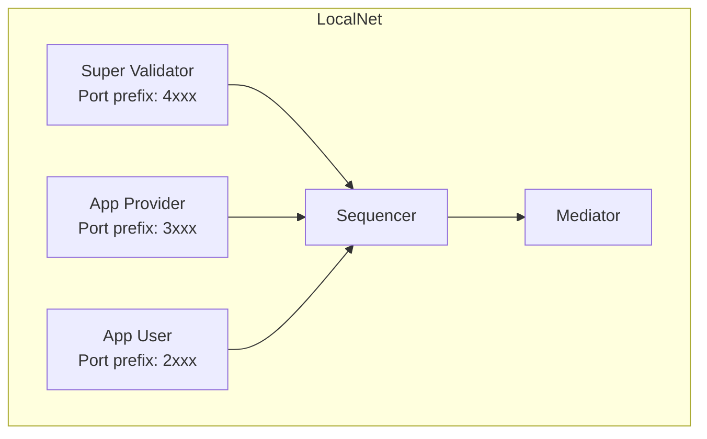

<Warning>
  이 페이지는 팀 리서치를 위한 비공식 한글 번역입니다. [공식 영어 원문](https://docs.canton.network/sdks-tools/development-tools/localnet.md)을 함께 확인하세요.
</Warning>

import DamlDocsSdksToolsDevelopmentToolsLocalnetL40 from "/snippets/daml-docs/sdks-tools_development-tools_localnet_L40.mdx";
import DamlDocsSdksToolsDevelopmentToolsLocalnetL55 from "/snippets/daml-docs/sdks-tools_development-tools_localnet_L55.mdx";
import DamlDocsSdksToolsDevelopmentToolsLocalnetL61 from "/snippets/daml-docs/sdks-tools_development-tools_localnet_L61.mdx";
import DamlDocsSdksToolsDevelopmentToolsLocalnetL197 from "/snippets/daml-docs/sdks-tools_development-tools_localnet_L197.mdx";
import ExternalSpliceMainSpliceRstCodeDocsSrcAppDevTestingLocalnetNone126 from "/snippets/internal/splice/main/splice-rst-code-docs-src-app-dev-testing-localnet-none-126.mdx";

{/* COPIED_START source="splice:docs/src/app_dev/testing/localnet.rst" hash="a3270359" */}

LocalNet은 NGINX gateway 뒤에 Participant 세 개, Validator 세 개, PostgreSQL database, Wallet/SV/Scan web application을 둔 단순한 Topology를 제공합니다. 각 Validator는 Splice ecosystem에서 서로 다른 role을 수행합니다.

- **app-provider**: Application을 운영하는 User용입니다.
- **app-user**: App Provider의 App을 사용하려는 User용입니다.
- **sv**: Global Synchronizer를 제공하고 AMT를 처리합니다.

LocalNet은 주로 개발/testing용으로 설계되었으며 production 용도가 아닙니다.

{/* COPIED_END */}

LocalNet은 [cn-quickstart](https://github.com/digital-asset/cn-quickstart) repository의 일부로 제공됩니다.

## LocalNet 제공 항목

- Super Validator, App Provider, App User의 Validator 세 개
- Sequencer/Mediator를 가진 local Synchronizer
- 각 Validator의 Canton Coin Wallet service
- PQS, Participant Query Store instance
- JSON API endpoint
- 선택 가능한 authentication용 Keycloak
- 선택 가능한 Grafana, Prometheus, Loki observability stack

## Setup

cn-quickstart repository에서 다음을 실행합니다.

<DamlDocsSdksToolsDevelopmentToolsLocalnetL40 />

`make setup`은 deployment profile 선택을 요청하고 적절한 `.env.local` configuration을 생성합니다. `make build`는 Daml Contract, Java backend, React frontend를 compile합니다. `make start`는 Docker Compose stack을 실행합니다.

실행 중인 container status를 확인합니다.

<DamlDocsSdksToolsDevelopmentToolsLocalnetL55 />

환경을 중지합니다.

<DamlDocsSdksToolsDevelopmentToolsLocalnetL61 />

## Network Topology

각 Validator는 Participant, Wallet service, supporting infrastructure를 실행합니다. Super Validator는 Synchronizer component인 Sequencer/Mediator와 Splice SV App도 실행합니다.

## Port Conventions

{/* COPIED_START source="splice:docs/src/app_dev/testing/localnet.rst" hash="a3270359" */}

## Exposed Ports

다음 section은 각 service가 사용하는 port를 설명합니다. Default database port는 **DB_PORT=5432**입니다.

다른 port는 Validator별 pattern으로 생성됩니다.

- Super Validator, SV: `4${PORT_SUFFIX}`
- App Provider: `3${PORT_SUFFIX}`
- App User: `2${PORT_SUFFIX}`

이 pattern은 다음 port suffix에 적용됩니다.

- **PARTICIPANT_LEDGER_API_PORT_SUFFIX**: 901
- **PARTICIPANT_ADMIN_API_PORT_SUFFIX**: 902
- **PARTICIPANT_JSON_API_PORT_SUFFIX**: 975
- **VALIDATOR_ADMIN_API_PORT_SUFFIX**: 903
- **CANTON_HTTP_HEALTHCHECK_PORT_SUFFIX**: 900
- **CANTON_GRPC_HEALTHCHECK_PORT_SUFFIX**: 961

UI port는 다음과 같습니다.

- **APP_USER_UI_PORT**: 2000
- **APP_PROVIDER_UI_PORT**: 3000
- **SV_UI_PORT**: 4000

## Application UIs

- **App User Wallet UI**

  > - **URL**: `http://wallet.localhost:2000`
  > - **설명**: User Wallet 관리 interface입니다.

- **App Provider Wallet UI**

  > - **URL**: `http://wallet.localhost:3000`
  > - **설명**: User Wallet 관리 interface입니다.

- **Super Validator Web UI**

  > - **URL**: `http://sv.localhost:4000`
  > - **설명**: Super Validator 기능 interface입니다.

- **Scan Web UI**

  > - **URL**: `http://scan.localhost:4000`
  > - **설명**: Transaction monitoring interface입니다.

<Note>
LocalNet round가 Scan UI에 표시되기까지 최대 6 round, 즉 한 시간이 걸릴 수 있습니다.
</Note>

대부분의 경우 `http://scan.localhost` 같은 `*.localhost` domain은 local host IP `127.0.0.1`로 resolve됩니다. Resolve되지 않으면 `/etc/hosts` file에 entry를 추가합니다. 예를 들어 `http://scan.localhost`와 `http://wallet.localhost`를 resolve하려면 다음 entry를 추가합니다.

<ExternalSpliceMainSpliceRstCodeDocsSrcAppDevTestingLocalnetNone126 />

## Default Wallet Users

- **App User**: app-user
- **App Provider**: app-provider
- **SV**: sv

{/* COPIED_END */}

예를 들어 App User Ledger API는 `localhost:2901`, App Provider JSON API는 `localhost:3975`입니다.

<Warning>
Admin API/PostgreSQL port는 개발 편의를 위해 expose됩니다. Non-local deployment에서는 expose하지 마세요.
</Warning>

## Configuration option

### Deployment profile

`make setup`은 포함할 optional service를 제어하는 deployment profile을 제공합니다.

- **Minimal** -- Core Validator/Synchronizer만 포함합니다.
- **Standard** -- PQS, JSON API, authentication을 추가합니다.
- **Full** -- Grafana, Prometheus, Loki observability를 추가합니다.

### Environment variable

`quickstart/` directory의 `.env` file에는 version number, feature flag, service configuration이 있습니다. Local setting을 override하려면 Git에서 tracking하지 않는 `.env.local` file을 생성합니다.

### Docker Compose Module

LocalNet은 `docker/modules/`의 modular Docker Compose layer로 구성됩니다.

- `localnet/` -- Validator/Synchronizer base infrastructure
- `auth/` -- Keycloak authentication
- `observability/` -- Grafana, Prometheus, Loki
- `pqs/` -- Participant Query Store instance
- `app/` -- Backend/frontend Application service

## Health check

Validator가 healthy한지 검증합니다.

<DamlDocsSdksToolsDevelopmentToolsLocalnetL197 />

Empty response는 healthy service를 의미합니다.

{/* COPIED_START source="splice:docs/src/app_dev/testing/localnet.rst" hash="a3270359" */}

## Multiple Synchronizer

LocalNet은 여러 Synchronizer를 함께 실행할 수 있습니다.

Default로 Super Validator가 control하는 Synchronizer 하나가 active합니다. 이 Synchronizer는 **Global Synchronizer**를 simulate합니다.

`app-synchronizer`라는 두 번째 Synchronizer를 활성화하려면 `multi-sync` Docker Compose profile인 `--profile multi-sync`로 LocalNet을 시작합니다. 추가 Synchronizer의 특성은 다음과 같습니다.

- `app-sequencer`와 `app-mediator` Node가 관리합니다.
- **Dedicated Synchronizer**를 simulate합니다.
- `app-provider`와 `app-user` Participant가 Global Synchronizer와 `app-synchronizer` 모두에 cross-connect됩니다.

## Non-default Protocol version 사용

LocalNet 실행 전에 `CANTON_PROTOCOL_VERSION` environment variable을 필요한 version으로 설정해 Synchronizer/Participant Protocol version을 구성할 수 있습니다. Non-stable Protocol version은 early testing에 사용할 수 있지만 명시적 opt-in이 필요합니다. 이를 위해 `ALPHA_PROTOCOL_VERSION_ENV=$LOCALNET_DIR/env/alpha-protocol-version.env` environment variable도 export합니다.

<Warning>
Non-stable Protocol version은 개발 중인 unreleased version이며 공지된 breaking change가 적용될 수 있습니다. 따라서 일반적으로 환경을 upgrade할 수 없고 변경마다 full reset이 필요합니다. Early testing/development에만 사용하세요.
</Warning>

{/* COPIED_END */}

## LocalNet/Sandbox 선택

다음 test에는 **LocalNet**을 사용합니다.

- 별도 Validator에 걸친 Multi-party workflow
- Canton Coin transfer/traffic purchase
- Wallet integration
- Scan/Validator API 같은 Splice API interaction
- Backend/frontend/Ledger end-to-end flow

다음에는 **[Sandbox](/sdks-tools/development-tools/sandbox)**를 사용합니다.

- Contract logic의 빠른 iteration
- Docker 없는 single-Participant testing
- `dpm test`와 Ledger API integration용 lightweight 환경

## 관련 페이지

- [cn-quickstart](/sdks-tools/reference-projects/cn-quickstart) -- Repository overview와 project structure입니다.
- [Sandbox](/sdks-tools/development-tools/sandbox) -- Lightweight single-node 대안입니다.
- [QuickStart walkthrough](/appdev/quickstart/running-the-demo) -- Demo application 실행 step-by-step guide입니다.
