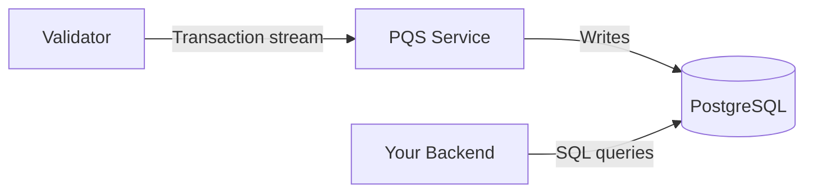

<Warning>
  이 페이지는 팀 리서치를 위한 비공식 한글 번역입니다. [공식 영어 원문](https://docs.canton.network/sdks-tools/development-tools/pqs.md)을 함께 확인하세요.
</Warning>

import DamlDocsSdksToolsDevelopmentToolsPqsL62 from "/snippets/daml-docs/sdks-tools_development-tools_pqs_L62.mdx";
import DamlDocsSdksToolsDevelopmentToolsPqsL73 from "/snippets/daml-docs/sdks-tools_development-tools_pqs_L73.mdx";
import DamlDocsSdksToolsDevelopmentToolsPqsL85 from "/snippets/daml-docs/sdks-tools_development-tools_pqs_L85.mdx";
import DamlDocsSdksToolsDevelopmentToolsPqsL96 from "/snippets/daml-docs/sdks-tools_development-tools_pqs_L96.mdx";
import DamlDocsSdksToolsDevelopmentToolsPqsL108 from "/snippets/daml-docs/sdks-tools_development-tools_pqs_L108.mdx";


PQS, Participant Query Store는 Validator transaction stream을 subscribe하고 Contract data를 PostgreSQL database에 project합니다. Backend는 이 database를 표준 SQL로 query해 Ledger API만으로는 비실용적인 filtered query, aggregation, join, full-text search를 수행합니다.

## PQS 동작 방식

PQS는 Validator 옆의 sidecar service로 실행됩니다. Validator transaction stream에 연결하고 현재 Ledger state/history data를 반영하는 PostgreSQL database를 유지합니다.



Validator가 update event를 emit하면 PQS가 대응 entry를 database에 insert합니다. Contract create/archive event와 exercise action을 모두 처리합니다. SQL query는 일반적으로 millisecond 단위의 작은 propagation delay를 두고 현재 Ledger state를 반영합니다.

## PQS 사용 시점

다음이 필요하면 PQS가 적합합니다.

- **하나 이상의 Contract를 대상으로 한 filtered query** -- "이번 달 만료되는 모든 license" 또는 "이 Party 소유의 모든 asset"
- **Aggregation/reporting** -- Contract data의 sum/count/average
- **Complex join** -- 여러 Template type의 data 조합
- **Full-text search** -- Keyword로 Contract field 검색
- **Ledger API에 load를 주지 않는 read path** -- PQS query는 Participant가 아니라 PostgreSQL을 사용합니다.

"ID로 특정 Contract 가져오기" 같은 단순하고 구체적인 query에는 PQS 없이 Ledger API Active Contract Set query로 충분합니다.

## 설정

PQS에는 PostgreSQL database와 Participant Node transaction stream connection이 필요합니다.

### LocalNet에서 사용

[cn-quickstart](https://github.com/digital-asset/cn-quickstart) LocalNet configuration에는 각 Validator용으로 pre-configured된 PQS instance가 포함됩니다. `make start` 실행 시 PQS가 자동으로 시작되어 data projection을 시작합니다.

### Standalone 설정

Standalone deployment 절차는 다음과 같습니다.

1. PostgreSQL database를 provision합니다. Version 14 이상을 권장합니다.
2. Participant Node Ledger API address와 authentication credential로 PQS를 설정합니다.
3. PQS service를 시작합니다. PQS는 schema 생성에 사용할 Package를 Validator에서 download합니다. PQS 시작 시와 새 Template detect 시 자동으로 수행됩니다.

PQS configuration은 다음을 포함합니다.

- **Participant connection** -- Ledger API host/port/authentication token
- **Database connection** -- PostgreSQL connection string
- **Party filter** -- Projection할 Party Contract data를 지정해 storage/processing을 줄입니다.
- **Template filter** -- 포함할 Template을 지정하며 선택 사항이고 default는 전체입니다.


## 설치 및 다운로드

PQS `3.5.x`는 major/minor version이 같은 Daml SDK/Canton `3.5.x` release를 대상으로 build되며 여러 Canton Participant Node version과 compatibility test를 거칩니다. 아래 Compatibility를 참조하세요.

### Daml SDK의 일부인 JAR

DPM CLI tool로 `scribe.jar` file을 다음처럼 download합니다.

> 1.  `dpm install <version>`, 예를 들면 `dpm install 3.5.1`로 `scribe.jar`를 포함한 SDK release를 가져옵니다.
> 2. `dpm pqs`로 JAR file의 command를 실행합니다.

<Note>
    `scribe.jar` directory를 찾으려면 `dpm resolve | grep scribe`를 입력해 raw JAR file path를 확인합니다.
</Note>


### Docker Image

| Source          | Location                                                                                                                                                                    |
|-----------------|-----------------------------------------------------------------------------------------------------------------------------------------------------------------------------|
| Browse UI       | <a href="https://console.cloud.google.com/artifacts/docker/da-images/europe/public/docker%2Fparticipant-query-store?project=da-images">사용 가능한 Docker version 보기</a> |
| Docker Registry | `europe-docker.pkg.dev/da-images/public/docker/participant-query-store:<version-tag>`                                                                                       |

PQS를 Docker container로 시작할 수도 있습니다.

``` text
docker run -it europe-docker.pkg.dev/da-images/public/docker/participant-query-store:3.5.2 --version
Picked up JAVA_TOOL_OPTIONS: -javaagent:/open-telemetry.jar
scribe, version: v3.5.2
daml-sdk.version: 3.5.1
postgres-document.schema: 041
```

### Helm Chart
<Note>
    이 Helm Chart는 version 3.5.x부터 제공됩니다.
</Note>

PQS 설치용 Helm Chart를 제공합니다.

``` text
helm upgrade --install -n pqs participant-query-store -f values.yaml \
oci://europe-docker.pkg.dev/da-images/public/charts/participant-query-store:3.5.2
```

| Source        | Location                                                                                                                                                                 |
|---------------|--------------------------------------------------------------------------------------------------------------------------------------------------------------------------|
| Browse UI     | <a href="https://console.cloud.google.com/artifacts/docker/da-images/europe/public/charts%2Fparticipant-query-store?project=da-images">사용 가능한 Chart image 보기</a> |
| Helm Registry | `europe-docker.pkg.dev/da-images/public/charts/participant-query-store:<version-tag>`                                                                                    |

#### 전체 `values.yaml` 예시


``` yaml
# Defines the container image registry, repository, and tag used for the PQS application
image:
  repo: europe-docker.pkg.dev/da-images/public/docker
  tag: "3.5.2"

# Defines a Kubernetes ServiceAccount name and its annotations when create is true
# Otherwise, specifies an existing Kubernetes ServiceAccount by name
# (e.g., for workload identity mapping).
serviceAccount:
  create: true
  name: pqs-sa
  annotations:
    iam.gke.io/gcp-service-account: pqs-service-account@my-project.iam.gserviceaccount.com

# (ONLY AVAILABLE FROM v3.5.5 ONWARDS)
# Enables PQS auto pruning
# Run as a kubernetes cronjob based on defined cron schedule
autoPrune:
  # Enable auto pruning (disabled by default)
  enabled: false

  # Define when the pqs pruning job will run format: POSIX 5 field cron schedule
  cronSchedule: "0 * * * *"

  # ISO 8601 - Default prunes >30 days
  maxAge: "P30D"

# Allows injection of custom initialization containers
# that run to completion before the main PQS app starts.
initContainers:
  - name: wait-for-postgres
    image: busybox:1.28
    command: ['sh', '-c', 'until nc -z postgres 5432; do echo waiting for db; sleep 2; done;']

# Allows injection of raw environment variables directly into the PQS container.
env:
  - name: JDK_JAVA_OPTIONS
    value: " -Dfile.encoding=UTF-8 -Djava.io.tmpdir=/tmp/myapp"

# Maps existing Kubernetes Secrets to environment variables,
# and then bridges those environment variables into the HOCON configuration file.
# Secret mappings
secrets:
- paths:
  - target.postgres.password
  secretKeyRef:
    name: postgres
    key: postgresPassword
- paths:
  - pipeline.oauth.clientSecret
  secretKeyRef:
    name: splice-app-validator-ledger-api-auth
    key: client-secret

# Configuration specifically targeted at the Pod level, such as custom annotations.
pod:
  # -- Annotations for pod
  annotations:
    prometheus.io/scrape: "true"
    prometheus.io/port: "8091"

# Defines container-level specifications of requests, limits, readinessProbe, and livenessProbe
# to ensure proper cluster scheduling and prevent resource starvation.
containers:
  resources:
    requests:
      memory: 256M
      cpu: 500m
    limits:
      memory: 3G
      cpu: 1000m
  readinessProbe:
    httpGet:
      path: /livez
      port: 8091
    initialDelaySeconds: 60
    periodSeconds: 15
  livenessProbe:
    httpGet:
      path: /livez
      port: 8091
    initialDelaySeconds: 60
    periodSeconds: 30

# Raw pqs config
pqs:
  # Configures the data ingestion pipeline, including the
  # data source type, contract filters, ledger read positions, and OAuth authentication specifics.
  pipeline:
    datasource: TransactionStream
    filter:
      betterWildcard: "true"
      contracts: "*"
      metadata: "*"
      parties: "*"
    ledger:
      start: Latest
      stop: Never
    oauth:
      clientId: splice-oauth-client-id
      issuer: "https://provider.oauth.com/fakeIssuer"
      endpoint: "https://provider.oauth.com/fakeIssuer/token"
      preemptExpiry: PT1M
      scope: daml_ledger_api
      parameters:
        audience: "http://fake.audience.com"

  # Defines the connection parameters to the participant node (Ledger API),
  # including host, port, authentication type, and connection keep-alive settings.
  source:
    ledger:
      auth: OAuth
      bufferSize: "128"
      cacheDir: "/tmp/scribe"
      host: participant
      keepAlive:
        time: PT40S
        timeout: PT20S
      port: "5001"

  # Specifies the retry policies and exponential backoff parameters for handling transient failures in the pipeline.
  retry:
    backoff:
      base: PT1S
      cap: PT1M
      factor: "2.0"
    counter:
      reset: PT10M

  # Configures the destination PostgreSQL database for the data queried from the participant.
  target:
    encoding:
      excludeNulls: "false"
      int64AsString: "true"
      numericAsString: "true"
    postgres:
      appName: scribe
      bufferSize: "128"
      database: public
      host: postgres
      keepAlive: "true"
      maxConnections: "16"
      username: "postgres"
      port: "5432"
      schema: pqs
      tls:
        mode: Disable
    schema:
      autoApply: "true"
      baseline: "false"

  # Configures the bind address and port for the application's health check endpoints,
  # which Kubernetes uses for liveness and readiness probes.
  health:
    address: "0.0.0.0"
    port: "8091"

  # Controls the logging behavior of the application, such as log levels (e.g., Info, Debug)
  # and output formats (e.g., Plain, JSON).
  logger:
    format: Plain
    level: Info
    mappings: {}
    pattern: Plain
```

### 호환성

PQS는 다음과 같이 여러 dependency version에 대한 호환성을 test합니다.

| Dependency              | Versions               |
|-------------------------|------------------------|
| Canton Participant Node | 3.4, 3.5               |
| Java Runtime (Temurin)  | 17, 21                 |
| PostgreSQL              | 13, 14, 15, 16, 17, 18 |


## SQL query 예시

### Active Contract

특정 Template의 모든 Active Contract를 query합니다.

<DamlDocsSdksToolsDevelopmentToolsPqsL62 />

### Transaction history

Party의 최근 transaction을 확인합니다.

<DamlDocsSdksToolsDevelopmentToolsPqsL73 />

### Aggregation

Template별 Active Contract 수를 계산합니다.

<DamlDocsSdksToolsDevelopmentToolsPqsL85 />

### Party filtering

특정 Party가 볼 수 있는 모든 Contract를 찾습니다.

<DamlDocsSdksToolsDevelopmentToolsPqsL96 />

## 성능 최적화

### Index

자주 query하는 column에는 index를 추가합니다. PQS는 시작할 때 기본 index를 생성하지만, application에 따라 추가 index가 유용할 수 있습니다.

<DamlDocsSdksToolsDevelopmentToolsPqsL108 />

### Connection pooling

Backend와 PQS database 사이에는 Java의 HikariCP나 Node.js의 `pg-pool` 같은 connection pool을 사용합니다. PQS 자체는 write를 위해 PostgreSQL에 별도의 connection을 유지합니다.

### Query pattern

- 큰 table에서는 `SELECT *`를 피하고 필요한 column을 지정합니다.
- Payload filter를 적용하기 전에 `template_id` filter로 dataset을 좁힙니다.
- 시간 범위 query에는 `effective_at` 또는 `created_at` column에 index를 추가합니다.

## High Availability 및 database 공유

### PQS High Availability

각 hosting Validator는 자체 PostgreSQL database를 사용하는 PQS instance를 실행합니다. 한 Validator의 PQS를 사용할 수 없으면 application이 다른 hosting Validator의 PQS로 failover할 수 있습니다.

PQS failover를 지원하도록 Backend를 설계합니다.

- Hosting Validator마다 하나씩 여러 PQS connection string을 설정합니다.
- Connection health check와 자동 failover를 구현합니다.
- 정상 운영 중 서로 다른 PQS instance의 offset이 조금 다를 수 있음을 고려합니다. Synchronizer가 대기 중인 update를 모두 전달하면 다시 수렴합니다.

### PQS database를 application table과 공유

PQS datastore를 사용하는 application은 embedded 방식, command line 또는 다른 지원 방식의 Flyway로 자체 database migration도 관리할 수 있습니다. Application 전용 index 생성이 한 예입니다.

Default 설정에서는 application Flyway가 파악한 사용 가능하고 유효한 migration이 PQS와 달라 error가 발생합니다. 하지만 application Flyway가 version 정보를 저장할 때 default가 아닌 다른 table name을 사용하도록 설정하면 두 Flyway를 같은 database에서 함께 사용할 수 있습니다.

```bash
flyway -configFiles=conf/flyway.toml migrate \
  -table=myapp_version \
  -baselineOnMigrate=true \
  -baselineVersion=0
```

이제 PQS와 application이 각자 schema version을 독립적으로 관리할 수 있습니다. 두 Flyway가 문제없이 공존하도록 application 변경은 index 추가와 그 밖의 충돌하지 않는 작업으로 제한해야 합니다.

## cn-quickstart의 PQS

cn-quickstart Backend는 `repository/` 및 `pqs/` module에서 PQS 사용법을 보여줍니다. `Pqs` class는 SQL query를 생성하고, `DamlRepository`는 PQS read와 Ledger API write를 결합한 domain 전용 method를 제공합니다.

자세한 code 예시는 [Backend Development](/appdev/modules/m4-backend-dev)를 참조하세요.

## 관련 페이지

- [Backend development](/appdev/modules/m4-backend-dev) -- Java Backend에서 PQS 사용
- [Ledger API](/sdks-tools/api-reference/ledger-api) -- PQS가 consume하는 기반 transaction stream
- [LocalNet](/sdks-tools/development-tools/localnet) -- Local development용으로 미리 설정된 PQS instance
