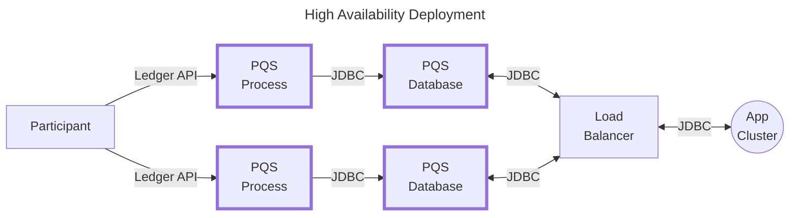

<Warning>
  이 페이지는 팀 리서치를 위한 비공식 한글 번역입니다. [공식 영어 원문](https://docs.canton.network/sdks-tools/development-tools/pqs/operate.md)을 함께 확인하세요.
</Warning>

## 실행 및 pruning

{/* COPIED_START source="docs-website:docs/replicated/pqs/3.4/component-howtos/pqs/operate.rst" hash="f00146d1" */}

PQS 실행에는 다음이 필요합니다.

- PostgreSQL database server
- Ledger data source인 Daml Sandbox 또는 Canton Participant Node
- 위 component에 필요한 access token 또는 TLS certificate
- PQS의 `scribe.jar` 또는 Docker image

### PQS 실행

PQS application은 대부분 장기 실행 process로 동작하지만 user가 상호 작용하는 여러 command도 포함합니다.

| Command                                    | 설명                                                            |
|--------------------------------------------|-----------------------------------------------------------------|
| `pipeline ledger postgres-document`        | 지속적인 Ledger data export 시작                                |
| `datastore postgres-document schema show`  | 필요한 database schema를 추론해 표시하고 종료                   |
| `datastore postgres-document schema apply` | 필요한 database schema를 추론해 datastore에 적용하고 종료       |
| `datastore postgres-document prune`        | 지정 offset까지 포함해 transaction을 prune하고 종료             |

각 command의 설정 방법은 `pqs-references-configuration-options`를 참조하세요.

PQS pipeline은 crash를 견디며 자동으로 restart합니다. Crash 후 PQS 복구 방식은 `pqs-ledger-streaming-and-recovery`를 참조하세요.

### 도움말 확인

Command와 parameter는 `--help` 및 `--help-verbose` argument로 가장 쉽게 살펴볼 수 있습니다. 예를 들어 download한 `.jar` file을 실행하는 경우는 다음과 같습니다.

``` text
$ ./scribe.jar --help
Usage: scribe COMMAND

An efficient ledger data exporting tool

Options:
  -h, --help            Print help information and quit
  -H, --help-verbose    Print help information with extra details and quit
  -v, --version         Print version information and quit

Commands:
  pipeline     Initiate continuous ledger data export
  datastore    Perform operations supporting a certified data store

Run 'scribe COMMAND --help[-verbose]' for more information on a command.
```

Docker를 사용하는 경우도 비슷합니다.

``` text
$ docker run -it europe-docker.pkg.dev/da-images/public/docker/participant-query-store:0.6.14 --help
Picked up JAVA_TOOL_OPTIONS: -javaagent:/open-telemetry.jar
Usage: scribe COMMAND

An efficient ledger data exporting tool

Commands:
  pipeline     Initiate continuous ledger data export
  datastore    Perform operations supporting a certified data store

Run 'scribe COMMAND --help[-verbose]' for more information on a command.
```

### History slicing

`pqs-ledger-streaming-and-recovery`에서 설명한 대로 `--pipeline-ledger-start` 및 `--pipeline-ledger-stop`으로 원하는 history 구간을 요청할 수 있습니다. Start/stop offset에는 제약이 있으며 이를 위반하면 PQS가 fail-fast합니다.

다음은 사용할 수 없습니다.

1.  **Ledger history 밖의 offset**

    ```mermaid
    gantt
        title Requested start '00' is outside of ledger history '01...10':
        axisFormat  %y
        Request :, 0000-01-01, 10y
        Participant Node :, 0001-01-01, 9y
    ```

    ```mermaid
    gantt
        title Requested start '06' is outside of ledger history '01...04':
        axisFormat  %y
        Request :, 0006-01-01, 4y
        Participant Node :, 0001-01-01, 3y
    ```

    ```mermaid
    gantt
        title Requested end '08' is outside of ledger history '00...03':
        axisFormat  %y
        Request :, 0000-01-01, 8y
        Participant Node :, 0000-01-01, 3y
    ```

2.  **Pruned offset 또는 pruning된 Ledger의 Genesis**

    ```mermaid
    gantt
        title Requested start 'GENESIS' is outside of ledger history '02...09':
        axisFormat  %y
        Request :, 0000-01-01, 9y
        Participant Node :, 0002-01-01, 7y
    ```

3.  **Datastore history에 gap을 만드는 offset**

    ```mermaid
    gantt
        title Requested offsets '05...09' will produce gap in datastore history '01...03':
        axisFormat  %y
        Request :, 0005-01-01, 4y
        Datastore :, 0001-01-01, 2y
    ```

4.  **PQS datastore history보다 앞선 offset**

    ```mermaid
    gantt
        title Cannot prepend to existing datastore. Requested start '00', datastore start '02':
        axisFormat  %y
        Request :, 0000-01-01, 10y
        Datastore :, 0002-01-01, 8y
    ```

<Note>
위 예시에서 각 항목은 다음을 나타냅니다.

- **Request**는 `--pipeline-ledger-start` 및 `--pipeline-ledger-stop` argument로 요청한 offset을 나타냅니다.
- **Participant Node**는 Participant Node에서 pruning되지 않은 Ledger history의 가용 범위를 나타냅니다.
- **Datastore**는 PQS database의 data를 나타냅니다.
</Note>

### Pruning

Database에서 오래되었거나 관련 없는 Ledger data를 제거하면 storage 크기를 줄이고 query 성능을 높일 수 있습니다. PQS는 PQS CLI 또는 `prune_archived_to_offset()` SQL function으로 Ledger data를 prune하는 두 방법을 제공합니다. `pqs-references-sql-api`를 참조하세요.

<Warning>
Legacy `prune_to_offset` function은 version 3.5.0부터 deprecated되었습니다. Deadlock을 일으키고 성능 bottleneck을 만드는 것으로 알려져 있습니다.

이를 대체하는 `prune_archived_to_offset`는 pruning logic을 변경해 이 문제를 해결합니다. Legacy function과 달리 새 variant는 historical transaction을 collapse하지 않습니다. 대신 모든 Active Contract를 변경 없이 보존하고 관련 event와 transaction을 유지합니다.
</Warning>

PQS에서 필요한 가장 오래된 offset을 결정하고 그보다 오래된 data를 정기적으로 prune하도록 설정합니다. 그러면 PQS database 크기가 계속 증가해도 시간이 지나면서 query 성능이 저하되는 것을 막을 수 있습니다. Ledger 시작부터 모든 data가 필요하다면 다음을 고려하세요.

- Data 증가율
- 해당 data를 여유 있게 저장할 database server 크기

<Warning>
`--prune-mode Force`를 사용한 `prune` CLI command 또는 PostgreSQL function `prune_archived_to_offset()` 호출은 data를 복구할 수 없게 삭제합니다.
</Warning>

### Data 삭제 및 변경

두 pruning 방법, CLI와 SQL function은 data 삭제 및 변경에 대해 같은 방식으로 동작합니다.

- Archived Contract와 관련 create/archive event를 제거합니다.
- Exercise와 대응하는 exercise event를 제거합니다.
- 더 이상 Active Contract를 참조하지 않는 transaction을 제거합니다.

또한 다음을 보장합니다.

- 현재 모든 Active Contract와 그 history는 그대로 유지됩니다.
- Pruning target보다 offset이 큰 transaction의 모든 data, transaction/event/Choice/Contract는 그대로 유지됩니다.

`--prune-target` 또는 `prune_archived_to_offset()` SQL function argument로 제공하는 target offset은 pruning operation의 영향을 받는 가장 높은 offset의 transaction입니다.

<Note>
제공한 offset에 관련 transaction이 없으면 그보다 큰 offset 중 가장 오래된 offset이 실제 target offset이 됩니다.
</Note>

Pruning은 되돌릴 수 없는 destructive operation입니다. 필요한 경우 pruning 전에 data를 backup하세요.

### 제약 조건

Pruning operation에는 다음 제약이 적용됩니다. `pqs-references-pqs-time-model`도 참조하세요.

1. 제공한 target offset은 contiguous history 범위 안에 있어야 합니다. 범위 밖이면 error가 발생합니다.
2. Pruning operation은 contiguous history의 최신 consistent checkpoint와 일치할 수 없습니다. 일치하면 error가 발생합니다.

### Command line에서 pruning

PQS CLI의 `prune` command로 지정한 offset, timestamp 또는 duration까지 Ledger data를 prune할 수 있습니다.

사용 가능한 모든 option의 상세 정보는 다음 command로 확인합니다.

``` text
$ ./scribe.jar datastore postgres-document prune --help-verbose
```

`prune` command를 사용하려면 pruning target을 argument로 제공해야 합니다. Target은 offset, timestamp 또는 duration, ISO 8601[^1]일 수 있습니다.

``` text
$ ./scribe.jar datastore postgres-document prune --prune-target '<offset>'
```

`prune` command는 기본적으로 실제 data를 삭제하지 않고 pruning 효과를 보여주는 dry run을 수행합니다. Pruning operation을 실행하려면 `--prune-mode Force` option을 추가합니다.

``` text
$ ./scribe.jar datastore postgres-document prune --prune-target '<offset>' --prune-mode Force
```

### Timestamp 및 duration 예시

`--prune-target`에 offset 외에도 timestamp 또는 duration을 pruning cut-off로 사용할 수 있습니다. 예를 들어 현재 기준 30일보다 오래된 data는 다음 command로 prune합니다.

``` text
$ ./scribe.jar datastore postgres-document prune --prune-target P30D
```

특정 timestamp까지 data를 prune하려면 다음 command를 사용합니다.

``` text
$ ./scribe.jar datastore postgres-document prune --prune-target 2023-01-30T00:00:00.000Z
```

### SQL function으로 pruning

`prune_archived_to_offset()`는 지정 offset까지 Ledger data를 prune하는 SQL function입니다. `datastore postgres-document prune` command와 같은 방식으로 동작하지만 dry-run option은 없습니다.

<Warning>
Legacy `prune_to_offset` function은 version 3.5.0부터 deprecated되었습니다. Deadlock을 일으키고 성능 bottleneck을 만드는 것으로 알려져 있습니다.

이를 대체하는 `prune_archived_to_offset`는 pruning logic을 변경해 이 문제를 해결합니다. Legacy function과 달리 새 variant는 historical transaction을 collapse하지 않습니다. 대신 모든 Active Contract를 변경 없이 보존하고 관련 event와 transaction을 유지합니다.
</Warning>

`prune_archived_to_offset()`를 사용하려면 offset을 제공합니다.

```sql
select * from prune_archived_to_offset('<offset>');
```

이 function은 위에서 설명한 대로 transaction을 삭제하고 Active Contract를 update합니다.

`prune_archived_to_offset()`와 `nearest_offset()` function을 결합해 특정 timestamp 또는 interval까지 data를 prune할 수 있습니다.

```sql
select * from prune_archived_to_offset(nearest_offset('1970-01-01 08:01:00+08' :: timestamp with time zone));
select * from prune_archived_to_offset(nearest_offset('PT2H' :: interval));
select * from prune_archived_to_offset(nearest_offset(interval '3 days'));
```

### Reset

Reset-to-offset은 지정 offset 이후의 모든 transaction을 PQS database에서 삭제하는 수동 절차입니다. 이후 transaction을 처리한 적이 없는 것처럼 해당 offset부터 처리를 restart할 수 있습니다.

<Warning>
Reset은 위험하고 destructive하며 영구적인 절차입니다. 전체 ecosystem과 조율해야 하며 단독으로 수행해서는 안 됩니다.
</Warning>

여러 상황에서 Ledger를 특정 시점으로 rollback할 때 reset이 유용할 수 있습니다. 예시는 다음과 같습니다.

1.  **예상하지 못한 새 entity** - Party 또는 Template 같은 새 scope가 조율 없이 Ledger transaction에 나타납니다. 즉 PQS가 새 entity를 사전에 알도록 restart되었는지 확인하지 않은 채 새 transaction이 들어온 경우입니다.
2.  **Ledger rollback** - Disaster recovery process로 Ledger를 rollback하면 PQS도 비슷하게 rollback해야 합니다. Participant Node와 조율이 필요한 수동 process입니다.

절차는 다음과 같습니다.

- PQS database를 사용하는 모든 application을 중지합니다.

- PQS process를 중지합니다.

- Administrator로 PostgreSQL에 연결합니다.

- PQS database reader의 상호 작용을 막습니다. `revoke connect`

- 남아 있는 다른 connection을 종료합니다.

  ```sql
  select pg_terminate_backend(pid)
  from pg_stat_activity
  where pid <> pg_backend_pid() and datname = current_database();
  ```

- Dry run으로 제안된 reset scope의 summary를 얻고 의도한 결과가 예상과 일치하는지 검증합니다.

  ```sql
  select * from validate_reset_offset("0000000000000a8000");
  ```

- 지정 offset 이후의 모든 transaction을 제거하는 destructive change를 적용하고 PQS가 제공된 offset부터 처리를 재개하도록 internal metadata를 조정합니다.

  ```sql
  select * from reset_to_offset("0000000000000a8000");
  ```

- PQS database user의 access를 다시 활성화합니다. `grant connect`

- Repair 후 Participant Node를 사용할 수 있을 때까지 기다립니다.

- PQS를 시작합니다.

- Ledger가 지정 offset으로 rollback된 것처럼 보이는 상황을 반영하도록 PQS database consumer에 필요한 remedial action을 수행합니다.

- PQS database를 사용하는 application을 시작하고 운영을 재개합니다.

<Warning>
제공한 target offset은 contiguous history 범위 안에 있어야 합니다. 범위 밖이면 error가 발생합니다.
</Warning>

<Note>
Database가 이전에 pruning되었고 reset target offset이 저장된 pruning offset보다 낮으면 `reset_to_offset`이 pruning offset을 reset target으로 후퇴시킵니다. 이 reset 후 `pruned_offset()`은 새 target offset을 반환합니다. Reset target이 pruning offset 이상이면 pruning state가 보존됩니다.
</Note>

### Redaction

Redaction 기능은 PQS database의 Contract와 Exercise에서 민감하거나 개인을 식별할 수 있는 정보를 제거합니다. Contract payload, Contract Key, Choice argument, Choice result를 영구 제거할 수 있어 privacy regulation과 data protection law 준수에 특히 유용합니다. Redaction은 destructive operation이며 제거된 정보는 복구할 수 없습니다.

Redaction process는 Contract 또는 Exercise에 `redaction_id`를 할당하고 민감한 data field를 null로 만듭니다. Contract에서는 `payload`와 `contract_key` field를, Exercise에서는 `argument`와 `result` field를 redact합니다.

### Redaction 조건

Contract와 Interface view에는 다음 조건이 적용됩니다.

- Active Contract는 redact할 수 없습니다.
- 이미 redact한 Contract는 다시 redact할 수 없습니다.

Choice exercise event의 redaction에는 제한이 없습니다.

Redaction operation에는 redaction을 식별하고 이유 정보를 제공하며 관련 활동을 조율하는 다른 system과 연계하기 위한 임의 label인 redaction ID가 필요합니다.

### 예시

#### Archived Contract redaction

Archived Contract를 redact하려면 `contract_id`와 `redaction_id`를 제공해 `redact_contract` function을 사용합니다. `redaction_id`는 redaction 이유를 식별하는 case reference를 제공하기 위한 것이며 조직 policy에 따라 설정해야 합니다. 이 operation은 Contract의 `payload`와 `contract_key`를 null로 만들고 `redaction_id`를 할당합니다.

```sql
select redact_contract('<contract_id>', '<redaction_id>');
```

Redaction은 Contract와 존재하는 경우 그 Interface view에 적용되며 영향을 받은 entry 수를 반환합니다.

#### Choice exercise redaction

Exercise를 redact하려면 Exercise의 `event_id`와 `redaction_id`를 제공해 `redact_exercise` function을 사용합니다. Exercise의 `argument`와 `result`를 null로 만들고 `redaction_id`를 할당합니다.

```sql
select redact_exercise('<event_id>', '<redaction_id>');
```

### Redaction 정보 access

Contract의 `redaction_id`는 SQL API의 다음 function에서 column으로 노출됩니다. Redact된 Contract의 `payload`와 `contract_key` column은 `NULL`입니다.

- `creates(...)`
- `archives(...)`
- `active(...)`
- `lookup_contract(...)`

Exercise event의 `redaction_id`는 SQL API의 다음 function에서 column으로 노출됩니다. Redact된 Exercise의 `argument` 및 `result` column은 `NULL`입니다.

- `exercises(...)`
- `lookup_exercises(...)`

#### Representative Package ID 지원

PQS는 Ledger API create event의 original Package ID가 연결된 Participant Node Package store에 없는 Contract payload ingestion을 지원하지 않습니다. Participant Node의 ACS import 절차에서 original Package ID가 Representative Package ID로 교체될 때 이런 상황이 발생할 수 있습니다.

<Note>
Contract의 original Package ID를 교체할 수 있는 ACS import/export 절차를 사용한다면 PQS 처리 중단을 피하도록 original Package ID도 Participant Node Package store에 upload해야 합니다.
</Note>

[^1]: [https://en.wikipedia.org/wiki/ISO_8601#Durations](https://en.wikipedia.org/wiki/ISO_8601#Durations)

{/* COPIED_END */}

## 관찰

{/* COPIED_START source="docs-website:docs/replicated/pqs/3.4/component-howtos/pqs/observe.rst" hash="69375e51" */}

이 section은 application health와 성능 monitoring을 돕도록 설계된 PQS observability 기능을 설명합니다.

### Observability 접근 방식

PQS는 observability 기능에 OpenTelemetry API를 사용합니다. OpenTelemetry protocol과 guideline에 정의된 적절한 configuration을 제공하면 trace, metric, log 세 signal source를 다양한 Backend로 export할 수 있습니다. 특정 방식을 과도하게 강제하지 않고 요구 사항과 기존 infrastructure에 맞는 observability Backend를 선택할 수 있습니다.

PQS가 observability data를 emit하게 하려면 PQS를 실행하는 JVM에 OpenTelemetry Java Agent를 attach해야 합니다. 시작에 필요한 정보는 OpenTelemetry Java Agent Configuration documentation[^1]에 있습니다.

자주 요청되는 shortcut으로 PQS에 내장된 Prometheus exposition endpoint를 통한 metric만 사용하려면 다음 snippet으로 시작할 수 있습니다. 자세한 내용은 공식 documentation을 참조하세요.

``` text
$ export OTEL_SERVICE_NAME=pqs
$ export OTEL_TRACES_EXPORTER=none
$ export OTEL_LOGS_EXPORTER=none
$ export OTEL_METRICS_EXPORTER=prometheus
$ export OTEL_EXPORTER_PROMETHEUS_PORT=9090
$ export JDK_JAVA_OPTIONS="-javaagent:path/to/opentelemetry-javaagent.jar"
$ ./scribe.jar pipeline ledger postgres-document ...
```

PQS Docker image에는 이 설정이 이미 적용되어 있지만 environment에 맞게 값을 override할 수 있습니다.

### Logging

### Log level

`--logger-level`로 log level을 설정합니다. 가능한 값은 `All`, `Fatal`, `Error`, `Warning`, `Info`, default, `Debug`, `Trace`입니다.

``` text
--logger-level=Debug
```

### Logger별 log level

`--logger-mappings`로 개별 logger의 log level을 조정합니다. 예를 들어 전체 log는 상세히 유지하면서 Netty network traffic을 제거하려면 다음과 같이 설정합니다.

``` text
--logger-mappings-io.netty=Warning \
--logger-mappings-io.grpc.netty=Trace
```

### Log pattern

`--logger-pattern`으로 `Plain`, default, DA application에서 사용하는 표준 format인 `Standard`, `Structured` 같은 predefined pattern을 사용하거나 자체 pattern을 설정합니다. 자세한 내용은 Log Format Configuration[^2]을 확인하세요.

Custom format을 사용하려면 다음과 같은 string 표현을 제공합니다.

``` text
--logger-pattern="%highlight{%fixed{1}{%level}} [%fiberId] %name:%line %highlight{%message} %highlight{%cause} %kvs"
```

### Console output의 log format

`--logger-format`으로 log format을 설정합니다. 가능한 값은 `Plain`, default 또는 `Json`입니다. `pipeline` command에 사용할 수 있습니다.

### File output의 log format

`--logger-format`으로 log format을 설정합니다. 가능한 값은 `Plain`, default, `Json`, `PlainAsync`, `JsonAsync`입니다. `prune` 같은 interactive command에 사용할 수 있습니다. `PlainAsync`와 `JsonAsync`는 log entry를 destination file에 asynchronous하게 기록합니다.

### File output의 destination file

`--logger-destination`으로 `prune` 같은 interactive command의 destination file path를 설정합니다. Default는 `output.log`입니다.

### Log format과 log pattern 조합

- `Plain` / `Plain`

  ``` text
  00:00:23.737 I [zio-fiber-0] com.digitalasset.scribe.pipeline.pipeline.Impl:34 Starting pipeline on behalf of 'Alice_1::12209982174bbaf1e6283234ab828bcab9b73fbe313315b181134bcae9566d3bbf1b'  application=scribe
  00:00:24.658 I [zio-fiber-0] com.digitalasset.scribe.pipeline.pipeline.Impl:61 Last checkpoint is absent. Seeding from ACS before processing transactions with starting offset '00000000000000000b'  application=scribe
  00:00:25.043 I [zio-fiber-895] com.digitalasset.zio.daml.ledgerapi.package:201 Contract filter inclusive of 1 templates and 0 interfaces  application=scribe
  00:00:25.724 I [zio-fiber-0] com.digitalasset.scribe.pipeline.pipeline.Impl:85 Continuing from offset '00000000000000000b' and index '0' until offset '00000000000000000b'  application=scribe
  ```

- `Plain` / `Standard`

  ``` text
  component=scribe instance_uuid=5f707d27-8188-4a44-904e-2f98ee9f4177 timestamp=2024-01-16T23:42:38.902+0000 level=INFO correlation_id=tbd description=Starting pipeline on behalf of 'Alice_1::1220c6d22d46d59c8454bd245e5a3bc238e5024d37bfd843dbad6885674f3a9673c5'  scribe=application=scribe
  component=scribe instance_uuid=5f707d27-8188-4a44-904e-2f98ee9f4177 timestamp=2024-01-16T23:42:39.734+0000 level=INFO correlation_id=tbd description=Last checkpoint is absent. Seeding from ACS before processing transactions with starting offset '00000000000000000b'  scribe=application=scribe
  component=scribe instance_uuid=5f707d27-8188-4a44-904e-2f98ee9f4177 timestamp=2024-01-16T23:42:39.982+0000 level=INFO correlation_id=tbd description=Contract filter inclusive of 1 templates and 0 interfaces  scribe=application=scribe
  component=scribe instance_uuid=5f707d27-8188-4a44-904e-2f98ee9f4177 timestamp=2024-01-16T23:42:40.476+0000 level=INFO correlation_id=tbd description=Continuing from offset '00000000000000000b' and index '0' until offset '00000000000000000b'  scribe=application=scribe
  ```

- `Plain` / `Custom`

  ``` text
  --logger-pattern=%timestamp{yyyy-MM-dd'T'HH:mm:ss} %level %name:%line %highlight{%message} %highlight{%cause} %kvs
  ```

  ``` text
  2024-01-16T23:55:52 INFO com.digitalasset.scribe.pipeline.pipeline.Impl:34 Starting pipeline on behalf of 'Alice_1::1220444f494b31c0a40c2f393edac3f5900325028c6f810a203a0334cd830ec230c8'  application=scribe
  2024-01-16T23:55:53 INFO com.digitalasset.scribe.pipeline.pipeline.Impl:61 Last checkpoint is absent. Seeding from ACS before processing transactions with starting offset '00000000000000000b'  application=scribe
  2024-01-16T23:55:53 INFO com.digitalasset.zio.daml.ledgerapi.package:201 Contract filter inclusive of 1 templates and 0 interfaces  application=scribe
  2024-01-16T23:55:53 INFO com.digitalasset.scribe.pipeline.pipeline.Impl:85 Continuing from offset '00000000000000000b' and index '0' until offset '00000000000000000b'  application=scribe
  ```

- `Json` / `Standard`

  ```json
  {"component":"scribe","instance_uuid":"03c263a0-6e3d-416e-b7f2-0e56b9e34841","timestamp":"2024-01-17T00:04:12.537+0000","level":"INFO","correlation_id":"tbd","description":"Starting pipeline on behalf of 'Alice_1::1220f03ed424480ab4487d88230fc033f3910f4cb4492fea68535a5760744b53dabe'","scribe":{"application":"scribe"}}
  {"component":"scribe","instance_uuid":"03c263a0-6e3d-416e-b7f2-0e56b9e34841","timestamp":"2024-01-17T00:04:13.551+0000","level":"INFO","correlation_id":"tbd","description":"Last checkpoint is absent. Seeding from ACS before processing transactions with starting offset '00000000000000000b'","scribe":{"application":"scribe"}}
  {"component":"scribe","instance_uuid":"03c263a0-6e3d-416e-b7f2-0e56b9e34841","timestamp":"2024-01-17T00:04:13.935+0000","level":"INFO","correlation_id":"tbd","description":"Contract filter inclusive of 1 templates and 0 interfaces","scribe":{"application":"scribe"}}
  {"component":"scribe","instance_uuid":"03c263a0-6e3d-416e-b7f2-0e56b9e34841","timestamp":"2024-01-17T00:04:14.659+0000","level":"INFO","correlation_id":"tbd","description":"Continuing from offset '00000000000000000b' and index '0' until offset '00000000000000000b'","scribe":{"application":"scribe"}}
  ```

- `Json` / `Structured`

  ```json
  {"timestamp":"2024-01-17T00:08:25+0000","level":"INFO","thread":"zio-fiber-0","location":"com.digitalasset.scribe.pipeline.pipeline.Impl:34","message":"Starting pipeline on behalf of 'Alice_1::122077c6b00e952ff694e2b25b6f5eb9582f815dfe793e2da668b119481a1dd5acdc'","application":"scribe"}
  {"timestamp":"2024-01-17T00:08:26+0000","level":"INFO","thread":"zio-fiber-0","location":"com.digitalasset.scribe.pipeline.pipeline.Impl:61","message":"Last checkpoint is absent. Seeding from ACS before processing transactions with starting offset '00000000000000000b'","application":"scribe"}
  {"timestamp":"2024-01-17T00:08:26+0000","level":"INFO","thread":"zio-fiber-882","location":"com.digitalasset.zio.daml.ledgerapi.package:201","message":"Contract filter inclusive of 1 templates and 0 interfaces","application":"scribe"}
  {"timestamp":"2024-01-17T00:08:26+0000","level":"INFO","thread":"zio-fiber-0","location":"com.digitalasset.scribe.pipeline.pipeline.Impl:85","message":"Continuing from offset '00000000000000000b' and index '0' until offset '00000000000000000b'","application":"scribe"}
  ```

- `Json` / `Custom`

  ``` text
  --logger-pattern=%label{timestamp}{%timestamp{yyyy-MM-dd'T'HH:mm:ss}} %label{level}{%level} %label{location}{%name:%line} %label{description}{%message} %label{cause}{%cause} %label{scribe}{%kvs}
  ```

  ```json
  {"timestamp":"2024-01-17T00:16:31","level":"INFO","location":"com.digitalasset.scribe.pipeline.pipeline.Impl:34","description":"Starting pipeline on behalf of 'Alice_1::1220ee13431ac437d454ea59d622cfc76599e0846a3caf166b4306d47b1bf83944a6'","scribe":{"application":"scribe"}}
  {"timestamp":"2024-01-17T00:16:33","level":"INFO","location":"com.digitalasset.scribe.pipeline.pipeline.Impl:61","description":"Last checkpoint is absent. Seeding from ACS before processing transactions with starting offset '00000000000000000b'","scribe":{"application":"scribe"}}
  {"timestamp":"2024-01-17T00:16:34","level":"INFO","location":"com.digitalasset.zio.daml.ledgerapi.package:201","description":"Contract filter inclusive of 1 templates and 0 interfaces","scribe":{"application":"scribe"}}
  {"timestamp":"2024-01-17T00:16:35","level":"INFO","location":"com.digitalasset.scribe.pipeline.pipeline.Impl:85","description":"Continuing from offset '00000000000000000b' and index '0' until offset '00000000000000000b'","scribe":{"application":"scribe"}}
  ```

  Json attribute-value pair를 나타내려면 `%label{your_label}{format}`을 사용해야 합니다.

### Application metric

PQS가 위와 같이 metric을 노출한다고 가정하면 `http://localhost:9090/metrics`에서 다음 metric에 access할 수 있습니다. 각 metric에는 의미와 type을 각각 설명하는 `# HELP` 및 `# TYPE` comment가 있습니다.

일부 metric type은 추가 구성 요소를 별도 metric으로 노출합니다. 예를 들어 `histogram`은 `max`, `count`, `sum`, 실제 범위별 `bucket`을 별도 time series로 추적합니다. 필요한 metric에는 operation type이나 관련 Template/Choice 같은 추가 context를 제공하는 label이 붙습니다.

Metric의 개념적 목록이며 실제 name은 Prometheus output을 참조하세요.

| Type      | Name                                        | 설명                                                                                      |
|-----------|---------------------------------------------|-------------------------------------------------------------------------------------------|
| gauge     | `watermark_ix`                              | 현재 watermark index, consistent read용 transaction 순번                                 |
| counter   | `pipeline_events_total`                     | 처리한 Ledger event                                                                       |
| histogram | `jdbc_conn_use`                             | Database connection 사용 latency                                                          |
| histogram | `jdbc_conn_isvalid`                         | Database connection validation latency                                                    |
| histogram | `jdbc_conn_commit`                          | Database connection commit latency                                                        |
| histogram | `total_tx_handling_latency`                 | PQS의 전체 transaction 처리 latency, LAPI 관찰부터 DB commit까지                          |
| gauge     | `tx_lag_from_ledger_wallclock`              | Ledger lag, command 완료부터 pipeline 수신까지 wall-clock 차이, ms                        |
| histogram | `pipeline_convert_acs_event`                | ACS event 변환 latency                                                                    |
| histogram | `pipeline_convert_transaction`              | Transaction 변환 latency                                                                  |
| histogram | `pipeline_prepare_batch_latency`            | Statement batch 준비 latency                                                              |
| histogram | `pipeline_execute_batch_latency`            | Statement batch 실행 latency                                                              |
| histogram | `pipeline_progress_watermark_latency`       | Watermark 진행 latency                                                                    |
| histogram | `pipeline_wp_acs_events_size`               | `pipeline_wp_acs_events` wait point의 in-flight work unit 수                              |
| histogram | `pipeline_wp_acs_statements_size`           | `pipeline_wp_acs_statements` wait point의 in-flight work unit 수                          |
| histogram | `pipeline_wp_acs_batched_statements_size`   | `pipeline_wp_acs_batched_statements` wait point의 in-flight work unit 수                  |
| histogram | `pipeline_wp_acs_prepared_statements_size`  | `pipeline_wp_acs_prepared_statements` wait point의 in-flight work unit 수                 |
| histogram | `pipeline_wp_events_size`                   | `pipeline_wp_events` wait point의 in-flight work unit 수                                  |
| histogram | `pipeline_wp_statements_size`               | `pipeline_wp_statements` wait point의 in-flight work unit 수                              |
| histogram | `pipeline_wp_batched_statements_size`       | `pipeline_wp_batched_statements` wait point의 in-flight work unit 수                      |
| histogram | `pipeline_wp_prepared_statements_size`      | `pipeline_wp_prepared_statements` wait point의 in-flight work unit 수                     |
| histogram | `pipeline_wp_watermarks_size`               | `pipeline_wp_watermarks` wait point의 in-flight work unit 수                              |
| counter   | `pipeline_wp_acs_events_total`              | `pipeline_wp_acs_events` wait point에서 처리한 work unit 수                               |
| counter   | `pipeline_wp_acs_statements_total`          | `pipeline_wp_acs_statements` wait point에서 처리한 work unit 수                           |
| counter   | `pipeline_wp_acs_batched_statements_total`  | `pipeline_wp_acs_batched_statements` wait point에서 처리한 work unit 수                   |
| counter   | `pipeline_wp_acs_prepared_statements_total` | `pipeline_wp_acs_prepared_statements` wait point에서 처리한 work unit 수                  |
| counter   | `pipeline_wp_events_total`                  | `pipeline_wp_events` wait point에서 처리한 work unit 수                                   |
| counter   | `pipeline_wp_statements_total`              | `pipeline_wp_statements` wait point에서 처리한 work unit 수                               |
| counter   | `pipeline_wp_batched_statements_total`      | `pipeline_wp_batched_statements` wait point에서 처리한 work unit 수                       |
| counter   | `pipeline_wp_prepared_statements_total`     | `pipeline_wp_prepared_statements` wait point에서 처리한 work unit 수                      |
| counter   | `pipeline_wp_watermarks_total`              | `pipeline_wp_watermarks` wait point에서 처리한 work unit 수                               |
| counter   | `app_restarts_total`                        | Recoverable failure로 pipeline을 restart한 횟수                                            |
| gauge     | `grpc_up`                                   | gRPC channel이 정상 운영 중인지 나타내는 indicator                                        |
| gauge     | `jdbc_conn_pool_up`                         | JDBC connection pool이 정상 운영 중인지 나타내는 indicator                               |

### Grafana dashboard

위 metric으로 PQS를 monitor하는 종합 dashboard를 만들 수 있습니다. Vendor가 제공하는 PQS Grafana dashboard는 artifact repository에서 download할 수 있으며 `pqs-download`를 참조하세요. 자체 dashboard의 출발점으로 사용할 수 있습니다.

``` text
grafana/v9.4.0/dashboard.json
grafana/v10.4.0/dashboard.json
grafana/v11.0.0/dashboard.json
```


### Health check

Health check endpoint `/livez`로 PQS process health를 monitor할 수 있습니다. 이 endpoint는 설정한 network interface인 `--health-address`와 TCP port인 `--health-port`에서 사용할 수 있습니다. Default는 `127.0.0.1:8080`입니다.

``` text
$ curl http://localhost:8080/livez
{"status":"ok"}
```

### Pipeline 실행 tracing

PQS는 실행 flow와 성능을 파악할 수 있도록 가장 중요한 operation 부분에 tracing instrument를 적용합니다. 적절한 configuration을 제공해 trace를 다양한 OpenTelemetry Backend로 export할 수 있습니다.

``` text
$ export OTEL_TRACES_EXPORTER=otlp
$ export OTEL_EXPORTER_OTLP_PROTOCOL=grpc
$ export OTEL_EXPORTER_OTLP_ENDPOINT="http://otel-collector:4317"
$ export JDK_JAVA_OPTIONS="-javaagent:path/to/opentelemetry-javaagent.jar"
$ ./scribe.jar pipeline ledger postgres-document ...
```

PQS는 다음 root span을 emit합니다.

| Span name                                                                                                                                   | 설명                                                                                                                           |
|---------------------------------------------------------------------------------------------------------------------------------------------|--------------------------------------------------------------------------------------------------------------------------------|
| `process metadata and schema`                                                                                                               | PQS 시작 시 datastore가 operation 준비 상태인지 확인하는 interaction                                                            |
| `initialization routine`                                                                                                                    | 시작 시 PQS가 offset 범위 경계를 설정하는 interaction, 요청 시 ACS seeding 포함                                                 |
| `consume com.daml.ledger.api.v1.TransactionService/GetTransactions` `consume com.daml.ledger.api.v1.TransactionService/GetTransactionTrees` | **\[Daml SDK v2.x\]** Ledger transaction이 gRPC로 전달된 후 datastore에 persist될 때까지 처리 timeline                          |
| `consume com.daml.ledger.api.v2.UpdateService/GetUpdates` `consume com.daml.ledger.api.v2.UpdateService/GetUpdateTrees`                     | **\[Daml SDK v3.x\]** Ledger transaction이 gRPC로 전달된 후 datastore에 persist될 때까지 처리 timeline                          |
| `execute datastore transaction`                                                                                                             | Transaction batch가 datastore에 persist될 때의 interaction                                                                      |
| `advance datastore watermark`                                                                                                               | 최신 연속 watermark가 datastore에 persist될 때의 interaction                                                                    |

모든 span에는 필요한 경우 OpenTelemetry attribute와 event를 통해 context 정보가 추가됩니다. 이 context data를 이해하는 것이 좋습니다. Asynchronous 및 parallel 실행 특성 때문에 PQS는 독립된 trace 사이의 causal relationship을 나타내기 위해 span link[^3]를 많이 사용합니다. 현대적인 trace visualization tool은 이 정보를 활용해 관련 trace를 이해하고 탐색하기 쉬운 형태로 제공합니다.

다음은 Ledger API에서 transaction을 받은 시점부터 Postgres의 PQS SQL API에서 보이게 될 때까지 이어지는 causal trace data 예시입니다.


``` text
Span #110
Trace ID       : 042ce1ffa24b34b38472933ac8209d54
Parent ID      :
ID             : d5c0071e1d9bbf76
Name           : consume com.daml.ledger.api.v1.TransactionService/GetTransactionTrees
Kind           : Consumer
Start time     : 2024-11-06 03:16:43.004004 +0000 UTC
End time       : 2024-11-06 03:16:43.004193 +0000 UTC
Status code    : Unset
Status message :
Attributes:
     -> messaging.operation.name: Str(consume)
     -> messaging.batch.message_count: Int(1)
     -> messaging.destination.name: Str(com.daml.ledger.api.v1.TransactionService/GetTransactionTrees)
     -> messaging.system: Str(canton)
     -> messaging.operation.type: Str(process)

Span #123
Trace ID       : 042ce1ffa24b34b38472933ac8209d54
Parent ID      : d5c0071e1d9bbf76
ID             : 9d60e1f4c42dce76
Name           : export transaction tree
Kind           : Internal
Start time     : 2024-11-06 03:16:43.004134 +0000 UTC
End time       : 2024-11-06 03:16:43.024574 +0000 UTC
Status code    : Unset
Status message :
Attributes:
     -> daml.effective_at: Str(2024-11-06T03:16:42.827847Z)
     -> daml.command_id: Str(3563113460)
     -> daml.events_count: Int(3)
     -> daml.workflow_id: Empty()
     -> daml.transaction_id: Str(122056219af2a73f913e1c2f0ce4422c156bc9cfdb5e5d49baaee0053bf3787f4a97)
     -> daml.offset: Str(000000000000000261)
Events:
SpanEvent #0
     -> Name: canonicalizing transaction tree
     -> Timestamp: 2024-11-06 03:16:43.004809542 +0000 UTC
SpanEvent #1
     -> Name: canonicalized transaction tree
     -> Timestamp: 2024-11-06 03:16:43.005138375 +0000 UTC
SpanEvent #2
     -> Name: converting canonical transaction to domain model
     -> Timestamp: 2024-11-06 03:16:43.005690625 +0000 UTC
SpanEvent #3
     -> Name: converted canonical transaction to domain model
     -> Timestamp: 2024-11-06 03:16:43.006170917 +0000 UTC
SpanEvent #4
     -> Name: released transaction model into batch
     -> Timestamp: 2024-11-06 03:16:43.015018459 +0000 UTC
SpanEvent #5
     -> Name: prepared SQL statements for transaction model
     -> Timestamp: 2024-11-06 03:16:43.015437 +0000 UTC
SpanEvent #6
     -> Name: flushed transaction model SQL to datastore
     -> Timestamp: 2024-11-06 03:16:43.019356042 +0000 UTC
SpanEvent #7
     -> Name: advanced datastore watermark
     -> Timestamp: 2024-11-06 03:16:43.024570334 +0000 UTC
     -> Attributes::
          -> index: Int(384)
          -> offset: Str(000000000000000261)
Links:
SpanLink #0
     -> Trace ID: 839da768a12333920b709410fb73911a
     -> ID: 276627b6e10f62c5
     -> TraceState:
     -> Attributes::
          -> target: Str(↥ ledger submission)
SpanLink #1
     -> Trace ID: 76c58361d46c08761c37ef5821e8fb78
     -> ID: 6051f05f10af0399
     -> TraceState:
     -> Attributes::
          -> target: Str(↧ persist to datastore)
SpanLink #2
     -> Trace ID: 71e67e2420deeef36ef3efacea6399dc
     -> ID: 161b5911e7a0ec18
     -> TraceState:
     -> Attributes::
          -> target: Str(↧ advance watermark)
```


``` text
Span #115
Trace ID       : 76c58361d46c08761c37ef5821e8fb78
Parent ID      :
ID             : 81f5f42361aa93ee
Name           : execute datastore transaction
Kind           : Internal
Start time     : 2024-11-06 03:16:43.015931 +0000 UTC
End time       : 2024-11-06 03:16:43.020991 +0000 UTC
Status code    : Unset
Status message :

Span #111
Trace ID       : 76c58361d46c08761c37ef5821e8fb78
Parent ID      : 81f5f42361aa93ee
ID             : 4bf8484e99999c64
Name           : acquire connection
Kind           : Internal
Start time     : 2024-11-06 03:16:43.016475 +0000 UTC
End time       : 2024-11-06 03:16:43.016688 +0000 UTC
Status code    : Unset
Status message :

Span #113
Trace ID       : 76c58361d46c08761c37ef5821e8fb78
Parent ID      : 81f5f42361aa93ee
ID             : 6051f05f10af0399
Name           : execute batch
Kind           : Internal
Start time     : 2024-11-06 03:16:43.016828 +0000 UTC
End time       : 2024-11-06 03:16:43.019494 +0000 UTC
Status code    : Unset
Status message :
Attributes:
     -> scribe.batch.models_count: Int(37)
Links:
SpanLink #0
     -> Trace ID: 33736b299a690b885c2314b9b17bde05
     -> ID: aba3d1dd6024ff71
     -> TraceState:
     -> Attributes::
          -> offset: Str(00000000000000025c)
          -> target: Str(↥ incoming transaction)
SpanLink #1
     -> Trace ID: 17f3edce9565defd379bf3ab8243f86d
     -> ID: 076afe5b4aac1212
     -> TraceState:
     -> Attributes::
          -> offset: Str(00000000000000025d)
          -> target: Str(↥ incoming transaction)
SpanLink #2
     -> Trace ID: 646ae61de95731c7726a6caee2d69ee9
     -> ID: bca9f5c28de74c90
     -> TraceState:
     -> Attributes::
          -> offset: Str(00000000000000025e)
          -> target: Str(↥ incoming transaction)
SpanLink #3
     -> Trace ID: 9ebd4d4f288b8b338f4192c0d7ea1b8c
     -> ID: a1d145fa9d76d5b3
     -> TraceState:
     -> Attributes::
          -> offset: Str(00000000000000025f)
          -> target: Str(↥ incoming transaction)
SpanLink #4
     -> Trace ID: e0716f968b5019a450da04317ea8f776
     -> ID: a75658ce89441bee
     -> TraceState:
     -> Attributes::
          -> offset: Str(000000000000000260)
          -> target: Str(↥ incoming transaction)
SpanLink #5
     -> Trace ID: 042ce1ffa24b34b38472933ac8209d54
     -> ID: 9d60e1f4c42dce76
     -> TraceState:
     -> Attributes::
          -> offset: Str(000000000000000261)
          -> target: Str(↥ incoming transaction)

Span #112
Trace ID       : 76c58361d46c08761c37ef5821e8fb78
Parent ID      : 6051f05f10af0399
ID             : 00419239933510fa
Name           : execute SQL
Kind           : Internal
Start time     : 2024-11-06 03:16:43.016855 +0000 UTC
End time       : 2024-11-06 03:16:43.019162 +0000 UTC
Status code    : Unset
Status message :
Attributes:
     -> scribe.__contracts.rows_count: Int(9)
     -> scribe.__exercises.rows_count: Int(3)
     -> scribe.__events.rows_count: Int(12)
     -> scribe.__archives.rows_count: Int(1)
     -> scribe.__transactions.rows_count: Int(6)

Span #114
Trace ID       : 76c58361d46c08761c37ef5821e8fb78
Parent ID      : 81f5f42361aa93ee
ID             : 9872ff55adc9e370
Name           : commit transaction
Kind           : Internal
Start time     : 2024-11-06 03:16:43.019916 +0000 UTC
End time       : 2024-11-06 03:16:43.020742 +0000 UTC
Status code    : Unset
Status message :
```


``` text
Span #124
Trace ID       : 71e67e2420deeef36ef3efacea6399dc
Parent ID      :
ID             : 161b5911e7a0ec18
Name           : advance datastore watermark
Kind           : Internal
Start time     : 2024-11-06 03:16:43.021507 +0000 UTC
End time       : 2024-11-06 03:16:43.024872 +0000 UTC
Status code    : Unset
Status message :
Attributes:
     -> scribe.watermark.offset: Str(000000000000000261)
     -> scribe.watermark.ix: Int(384)
Links:
SpanLink #0
     -> Trace ID: 76c58361d46c08761c37ef5821e8fb78
     -> ID: 6051f05f10af0399
     -> TraceState:
     -> Attributes::
          -> target: Str(↥ persist to datastore)

Span #116
Trace ID       : 71e67e2420deeef36ef3efacea6399dc
Parent ID      : 161b5911e7a0ec18
ID             : 33ab3918ebfe138d
Name           : acquire connection
Kind           : Internal
Start time     : 2024-11-06 03:16:43.022009 +0000 UTC
End time       : 2024-11-06 03:16:43.022222 +0000 UTC
Status code    : Unset
Status message :

Span #6
Trace ID       : 71e67e2420deeef36ef3efacea6399dc
Parent ID      : 161b5911e7a0ec18
ID             : 1a66240dfd597654
Name           : UPDATE scribe.__watermark
Kind           : Client
Start time     : 2024-11-06 03:16:43.022737084 +0000 UTC
End time       : 2024-11-06 03:16:43.023134917 +0000 UTC
Status code    : Unset
Status message :
Attributes:
     -> db.operation: Str(UPDATE)
     -> db.sql.table: Str(__watermark)
     -> db.name: Str(scribe)
     -> db.connection_string: Str(postgresql://postgres-scribe:5432)
     -> server.address: Str(postgres-scribe)
     -> server.port: Int(5432)
     -> db.user: Str(pguser)
     -> db.statement: Str(update __watermark set "offset" = ?, ix = ?;)
     -> db.system: Str(postgresql)

Span #117
Trace ID       : 71e67e2420deeef36ef3efacea6399dc
Parent ID      : 161b5911e7a0ec18
ID             : f0b24fb074fe41f8
Name           : commit transaction
Kind           : Internal
Start time     : 2024-11-06 03:16:43.023629 +0000 UTC
End time       : 2024-11-06 03:16:43.024157 +0000 UTC
Status code    : Unset
Status message :
```

### Trace context propagation

PQS는 Ledger API에서 직접 streaming 방식으로 받기보다 SQL을 통해 data에 access하려는 downstream application과 Ledger instance 사이의 intermediary입니다. Canton과 PostgreSQL이라는 두 data storage system 사이에 pipeline을 구성하지만, 자체 trace context가 아니라 propagation을 위해 original Ledger transaction의 trace context를 저장합니다. `open-tracing-ledger-api-client`도 참조하세요. 따라서 downstream application은 original submission trace에 child span으로 연결할지, span link로 연결된 새 trace로 만들지 직접 결정할 수 있습니다.

```sql
select "offset",
       (trace_context).trace_parent,
       (trace_context).trace_state
from transactions limit 1;
```

``` text
offset       |                      trace_parent                       |   trace_state
--------------------+---------------------------------------------------------+-----------------
0000000000000000bb | 00-f35923baa38cc520a1fc3aec6771380b-b4cf363cbf5efa6a-01 | foo=bar,baz=qux
```

``` text
Span #85
    Trace ID       : f35923baa38cc520a1fc3aec6771380b
    Parent ID      : d3300bedd4c64511
    ID             : b4cf363cbf5efa6a
    Name           : MessageDispatcher.handle
    Kind           : Internal
    Start time     : 2024-11-05 04:01:40.808 +0000 UTC
    End time       : 2024-11-05 04:01:40.822694083 +0000 UTC
    Status code    : Unset
    Status message :
Attributes:
     -> canton.class: Str(com.digitalasset.canton.participant.protocol.EnterpriseMessageDispatcher)
↑↑↑ span context propagated through transaction/tree stream in Ledger API

↓↓↓ following parent's links chain leads us to the root span of original submission
Span #19
    Trace ID       : f35923baa38cc520a1fc3aec6771380b
    Parent ID      :
    ID             : de3aed62b5fb43ce
    Name           : com.daml.ledger.api.v1.CommandService/SubmitAndWaitForTransaction
    Kind           : Server
    Start time     : 2024-11-05 04:01:40.569 +0000 UTC
    End time       : 2024-11-05 04:01:40.866904459 +0000 UTC
    Status code    : Unset
    Status message :
Attributes:
     -> rpc.method: Str(SubmitAndWaitForTransaction)
     -> daml.submitter: Str()
     -> rpc.service: Str(com.daml.ledger.api.v1.CommandService)
     -> net.peer.port: Int(38640)
     -> net.transport: Str(ip_tcp)
     -> daml.workflow_id: Str()
     -> daml.command_id: Str(3498760027)
     -> rpc.system: Str(grpc)
     -> net.peer.ip: Str(172.18.0.15)
     -> daml.application_id: Str(appid)
     -> rpc.grpc.status_code: Int(0)
```

PQS의 `transactions.trace_context` column에 저장된 data에 access하면 application이 propagated trace context[^4]를 다시 생성해 runtime instrumentation library에서 사용할 수 있습니다.

### Diagnostic

PQS는 diagnostic telemetry snapshot을 export할 수 있습니다. 이 data export archive에는 다음과 같은 핵심 troubleshooting 정보가 있습니다.

- 일정 기간의 application thread dump
- 일정 기간의 application metric

`netcat` tool로 socket에 access하면 archive를 가져올 수 있습니다.

``` text
$ nc localhost 9091 > health-dump.zip
$ unzip health-dump.zip
Archive:  health-dump.zip
  inflating: metrics.openmetrics
  inflating: threads-20250307-105606.zip
```

다음 표는 왼쪽에서 오른쪽 순으로 우선순위가 낮아지는 configuration source를 나열합니다.

| System property                      | Environment variable                 | Default value | 설명                                                                                                                                            |
|--------------------------------------|--------------------------------------|---------------|-------------------------------------------------------------------------------------------------------------------------------------------------|
| `da.diagnostics.enabled`             | `DA_DIAGNOSTICS_ENABLED`             | `true`        | Diagnostic data 수집 및 exposition 활성화/비활성화                                                                                              |
| `da.diagnostics.host`                | `DA_DIAGNOSTICS_HOST`                | `127.0.0.1`   | Exposition socket binding에 사용할 hostname 또는 IP address                                                                                    |
| `da.diagnostics.port`                | `DA_DIAGNOSTICS_PORT`                | `0`           | Exposition socket binding에 사용할 port, `0`은 random port                                                                                      |
| `da.diagnostics.dump.path`           | `DA_DIAGNOSTICS_DUMP_PATH`           | `<empty>`     | Graceful shutdown 시 write할 directory, 기존의 write 가능한 directory여야 함                                                                   |
| `da.diagnostics.metrics.interval`    | `DA_DIAGNOSTICS_METRICS_INTERVAL`    | `PT10S`       | ISO 8601 format의 metric 수집 interval                                                                                                           |
| `da.diagnostics.metrics.buffer.size` | `DA_DIAGNOSTICS_METRICS_BUFFER_SIZE` | `60`          | Monitor하는 metric별 저장 sample 수, **rolling window**                                                                                          |
| `da.diagnostics.metrics.tags`        | `DA_DIAGNOSTICS_METRICS_TAGS`        | `<empty>`     | Exposition 중 각 metric에 추가할 comma-separated label, 예: `job=myapp,env=staging,deployed=20250101`                                            |
| `da.diagnostics.threads.interval`    | `DA_DIAGNOSTICS_THREADS_INTERVAL`    | `PT1M`        | ISO 8601 format의 thread dump 수집 interval                                                                                                      |
| `da.diagnostics.threads.buffer.size` | `DA_DIAGNOSTICS_THREADS_BUFFER_SIZE` | `10`          | 저장할 thread dump 수, **rolling window**                                                                                                        |

[^1]: [https://opentelemetry.io/docs/zero-code/java/agent/configuration/](https://opentelemetry.io/docs/zero-code/java/agent/configuration/)

[^2]: [https://zio.dev/zio-logging/formatting-log-records/#log-format-configuration](https://zio.dev/zio-logging/formatting-log-records/#log-format-configuration)

[^3]: [https://opentelemetry.io/docs/specs/otel/overview/#links-between-spans](https://opentelemetry.io/docs/specs/otel/overview/#links-between-spans)

[^4]: [https://www.w3.org/TR/trace-context/](https://www.w3.org/TR/trace-context/)

{/* COPIED_END */}

## 복구

{/* COPIED_START source="docs-website:docs/replicated/pqs/3.4/component-howtos/pqs/recover.rst" hash="0a28a79f" */}

PQS는 다음 원칙으로 availability를 높이는 장기 실행 process로 설계되었습니다.

- **Redundancy**는 한 instance가 실패해도 system을 계속 사용할 수 있도록 여러 PQS instance를 parallel하게 실행합니다.
- **Retry**는 process를 종료하거나 Operator 개입을 요구하지 않고 일시적이고 복구 가능한 failure에서 회복합니다.
- **Recovery**는 cold start 후 현재 Ledger state와 datastore에 이미 export된 data를 조정하고 최신 checkpoint부터 계속 진행합니다.

### High Availability

서로 cross-dependency가 없는 여러 격리된 PQS instance를 만들 수 있어 active-active High Availability clustering model을 구성할 수 있습니다. 처리 속도 차이와 일반적인 network non-determinism 때문에 instance별 offset이 같지 않을 수 있습니다. PQS SQL API는 이 eventual consistency model을 처리하고 reader에게 최소한 repeatable read consistency를 보장하는 기능을 제공합니다. 자세한 내용은 `pqs-references-offset-management`의 `validate_offset_exists()`를 참조하세요.



### Retry

PQS `pipeline` command는 `source` 및 `target` dependency의 availability에 크게 의존하는 단방향 streaming process입니다. Recoverable로 지정된 error가 발생하면 internal engine을 restart해 복구를 시도합니다.

- gRPC[^1] (white-listed; retries if):
  - `CANCELLED`
  - `DEADLINE_EXCEEDED`
  - `NOT_FOUND`
  - `PERMISSION_DENIED`
  - `RESOURCE_EXHAUSTED`
  - `FAILED_PRECONDITION`
  - `ABORTED`
  - `INTERNAL`
  - `UNAVAILABLE`
  - `DATA_LOSS`
  - `UNAUTHENTICATED`
- JDBC[^2] (black-listed; retries unless):
  - `INVALID_PARAMETER_TYPE`
  - `PROTOCOL_VIOLATION`
  - `NOT_IMPLEMENTED`
  - `INVALID_PARAMETER_VALUE`
  - `SYNTAX_ERROR`
  - `UNDEFINED_COLUMN`
  - `UNDEFINED_OBJECT`
  - `UNDEFINED_TABLE`
  - `UNDEFINED_FUNCTION`
  - `NUMERIC_CONSTANT_OUT_OF_RANGE`
  - `NUMERIC_VALUE_OUT_OF_RANGE`
  - `DATA_TYPE_MISMATCH`
  - `INVALID_NAME`
  - `CANNOT_COERCE`
  - `UNEXPECTED_ERROR`
- Daml Package, 다음 경우 retry:
  - Transaction이 pipeline 시작 시 존재하지 않았던 Daml Package를 참조합니다.

### Configuration

다음 `pqs-references-configuration-options`로 PQS retry 동작을 제어할 수 있습니다.

``` text
--retry-backoff-base string      Base time (ISO 8601) for backoff retry strategy (default: PT1S)
--retry-backoff-cap string       Max duration (ISO 8601) between attempts (default: PT1M)
--retry-backoff-factor double    Factor for backoff retry strategy (default: 2.0)
--retry-counter-attempts int     Max attempts before giving up (optional)
--retry-counter-reset string     Reset retry counters after period (ISO 8601) of stability (default: PT10M)
--retry-counter-duration string  Time limit (ISO 8601) before giving up (optional)
```

`--retry-backoff-*` setting은 retry 주기와 시도 사이의 최대 duration을 제어합니다.

`--retry-counter-attempts` 및 `--retry-counter-duration`은 종료 전 허용할 최대 *instability*를 제어합니다.

`--retry-counter-reset`은 모든 retry counter를 reset하기까지 필요한 *stability* 기간을 제어합니다.

### 동적 Daml Package reload

PQS가 알 수 없는 Daml Package를 참조하는 transaction을 만나도 종료하지 않고 다음과 같이 동작합니다.

1. Ingestion이 일시 중지됩니다.
2. PQS가 Participant Node에서 새 Package를 가져옵니다.
3. Type mapping을 rebuild합니다.
4. 중지된 offset부터 ingestion을 재개합니다.

PQS 실행 중 Participant Node에 새 DAR가 deploy되는 경우를 처리하며 restart는 필요하지 않습니다.

확인할 **log message**:

```
Recoverable: unknown Daml package detected.
```

**Metric**: 이 상황이 발생할 때마다 `exception="Recoverable: unknown Daml package detected."` label이 있는 `app_restarts_total`이 증가합니다.

<Note>
Dynamic Package reload는 새로 deploy된 Daml Package에만 적용됩니다. Filter의 Party, Template, Interface 같은 다른 configuration 변경에는 여전히 restart가 필요합니다.
</Note>

### Logging

PQS 복구 중에는 진행 상황을 나타내는 다음 log message가 emit됩니다.

``` text
12:52:26.753 I [zio-fiber-257] com.digitalasset.scribe.appversion.package:14 scribe, version: UNSPECIFIED  application=scribe
12:52:16.725 I [zio-fiber-0] com.digitalasset.scribe.pipeline.Retry.retryRecoverable:48 Recoverable GRPC exception. Attempt 1, unstable for 0 seconds. Remaining attempts: 42. Remaining time: 10 minutes. Exception in thread "zio-fiber-" java.lang.Throwable: Recoverable GRPC exception.
    Suppressed: io.grpc.StatusException: UNAVAILABLE: io exception
        Suppressed: io.netty.channel.AbstractChannel$AnnotatedConnectException: Connection refused: localhost/[0:0:0:0:0:0:0:1]:6865
            Suppressed: java.net.ConnectException: Connection refused application=scribe
12:52:29.007 I [zio-fiber-0] com.digitalasset.scribe.pipeline.Retry.retryRecoverable:48 Recoverable GRPC exception. Attempt 2, unstable for 12 seconds. Remaining attempts: 41. Remaining time: 9 minutes 47 seconds. Exception in thread "zio-fiber-" java.lang.Throwable: Recoverable GRPC exception.
    Suppressed: io.grpc.StatusException: UNAVAILABLE: io exception
        Suppressed: io.netty.channel.AbstractChannel$AnnotatedConnectException: Connection refused: localhost/[0:0:0:0:0:0:0:1]:6865
            Suppressed: java.net.ConnectException: Connection refused application=scribe
12:52:51.237 I [zio-fiber-0] com.digitalasset.scribe.pipeline.Retry.retryRecoverable:48 Recoverable GRPC exception. Attempt 3, unstable for 34 seconds. Remaining attempts: 40. Remaining time: 9 minutes 25 seconds. Exception in thread "zio-fiber-" java.lang.Throwable: Recoverable GRPC exception.
    Suppressed: io.grpc.StatusException: UNAVAILABLE: io exception
        Suppressed: io.netty.channel.AbstractChannel$AnnotatedConnectException: Connection refused: localhost/[0:0:0:0:0:0:0:1]:6865
            Suppressed: java.net.ConnectException: Connection refused application=scribe
12:53:33.473 I [zio-fiber-0] com.digitalasset.scribe.pipeline.Retry.retryRecoverable:48 Recoverable GRPC exception. Attempt 4, unstable for 1 minute 16 seconds. Remaining attempts: 39. Remaining time: 8 minutes 43 seconds. Exception in thread "zio-fiber-" java.lang.Throwable: Recoverable GRPC exception.
    Suppressed: io.grpc.StatusException: UNAVAILABLE: io exception
        Suppressed: io.netty.channel.AbstractChannel$AnnotatedConnectException: Connection refused: localhost/[0:0:0:0:0:0:0:1]:6865
            Suppressed: java.net.ConnectException: Connection refused application=scribe
12:54:36.328 I [zio-fiber-0] com.digitalasset.scribe.pipeline.Retry.retryRecoverable:48 Recoverable JDBC exception. Attempt 5, unstable for 2 minutes 19 seconds. Remaining attempts: 38. Remaining time: 7 minutes 40 seconds. Exception in thread "zio-fiber-" java.lang.Throwable: Recoverable JDBC exception.
    Suppressed: org.postgresql.util.PSQLException: Connection to localhost:5432 refused. Check that the hostname and port are correct and that the postmaster is accepting TCP/IP connections.
        Suppressed: java.net.ConnectException: Connection refused application=scribe
```

### Metrics

PQS dependency stability를 monitor할 수 있는 다음 metric이 제공됩니다. 일반 observability에 대한 자세한 내용은 `pqs-application-metrics`를 참조하세요.

``` text
### TYPE app_restarts_total counter
### HELP app_restarts_total Number of total app restarts due to recoverable errors
app_restarts_total{,exception="Recoverable GRPC exception."} 5.0

### TYPE grpc_up gauge
### HELP grpc_up Grpc channel is up
grpc_up{} 1.0

### TYPE jdbc_conn_pool_up gauge
### HELP jdbc_conn_pool_up JDBC connection pool is up
jdbc_conn_pool_up{} 1.0
```

### Retry counter reset

PQS가 network unavailability를 만나면 시도할 때마다 retry counter를 늘립니다. 이 counter는 `--retry-counter-reset`으로 정의한 stability 기간이 지나야 reset됩니다. 따라서 짧은 정상 운영과 intermittent failure가 번갈아 장기간 이어지는 동안 PQS는 전체 system stability를 보수적으로 판단합니다. 다음 예시로 설명할 수 있습니다.

`--retry-counter-reset PT5M` 설정에서 retry 동작은 다음 timeline과 같습니다.

``` text
time -->       1:00            5:00               10:00
                v               v                   v
operation:  ====xx=x====x=======x========================
                ^               ^                   ^
                A               B                   C

x - a failure causing retry happens
= - operating normally
```

위 timeline에서는 A 지점부터 intermittent failure가 시작되고, 각 retry 시도가 전체 backoff schedule을 늘립니다. 따라서 뒤의 retry일수록 system 복구에 더 많은 시간을 줍니다. 마지막 failure인 B 지점 이후 설정한 stability 기간에 도달할 때까지, 예를 들어 C 지점처럼 5분간 failure 없이 운영될 때까지 schedule은 initial value로 reset되지 않습니다.

### Exit code

PQS는 다음 exit code로 종료됩니다.

- `0`: 정상 종료
- `1`: 복구 불가능한 error 또는 복구 가능한 error의 모든 retry 소진으로 종료

### Ledger streaming 및 recovery

PQS는 시작 또는 restart 시 마지막으로 저장한 checkpoint를 확인하고 그 지점부터 incremental processing을 계속합니다. Argument로 지정한 Ledger offset에서 시작하고 종료할 수 있습니다.

많은 scenario에서 `--pipeline-ledger-start Oldest --pipeline-ledger-stop Never`가 사용 가능한 모든 history의 초기 population과 resume/recovery processing 모두에 가장 적합한 configuration입니다.

Start offset 의미:

| Value      | 의미                                                                                                    |
|------------|---------------------------------------------------------------------------------------------------------|
| `Genesis`  | Ledger의 첫 offset에서 시작하며 사용할 수 없으면 실패합니다.                                           |
| `Oldest`   | 처리를 resume하거나 datastore가 비어 있으면 Ledger에서 사용 가능한 가장 오래된 offset부터 시작합니다. |
| `Latest`   | 처리를 resume하거나 datastore가 비어 있으면 Ledger에서 사용 가능한 최신 offset부터 시작합니다.        |
| `<offset>` | 처리를 시작할 offset이며 datastore state와 일치하지 않으면 종료합니다.                                 |

Stop offset 의미:

| Value      | 의미                                                                              |
|------------|-----------------------------------------------------------------------------------|
| `Latest`   | Ledger에서 사용 가능한 최신 offset에 도달할 때까지 처리한 뒤 종료합니다.          |
| `Never`    | 계속 처리하며 종료하지 않습니다.                                                 |
| `<offset>` | 이 offset에 도달할 때까지 처리한 뒤 종료합니다.                                  |

<div className="caution">

Ledger가 `--pipeline-ledger-start`로 지정한 offset 이후까지 pruning되었다면 PQS 시작이 실패합니다. 자세한 내용은 `pqs-history-slicing`을 참조하세요.

</div>

[^1]: [https://grpc.io/docs/guides/status-codes/](https://grpc.io/docs/guides/status-codes/)

[^2]: [https://github.com/pgjdbc/pgjdbc/blob/master/pgjdbc/src/main/java/org/postgresql/util/PSQLState.java](https://github.com/pgjdbc/pgjdbc/blob/master/pgjdbc/src/main/java/org/postgresql/util/PSQLState.java)

{/* COPIED_END */}

## 보안

{/* COPIED_START source="docs-website:docs/replicated/pqs/3.4/component-howtos/pqs/secure.rst" hash="6ca16d7c" */}

PQS application은 Ledger와 database Backend service의 client이므로 해당 service가 요구하는 TLS 및 authentication security setting을 따라야 합니다.

### TLS

Server-side component인 Canton과 PostgreSQL에서 TLS 사용을 요구할 수 있습니다. 설정 방법은 각 documentation을 참조하세요.

- PostgreSQL: [https://www.postgresql.org/docs/current/ssl-tcp.html](https://www.postgresql.org/docs/current/ssl-tcp.html)
- Canton: `tls-configuration`

설정을 마치면 전용 parameter에 적절한 값을 사용합니다.

``` text
$ ./scribe.jar pipeline ledger postgres-document \
     --source-ledger-tls-cert /path/to/ledger.crt \
     --source-ledger-tls-key /path/to/ledger.pem \
     --source-ledger-tls-cafile /path/to/ledger.crt \
     --target-postgres-tls-cert /path/to/postgres.crt \
     --target-postgres-tls-key /path/to/postgres.der \
     --target-postgres-tls-cafile /path/to/postgres.crt \
     --target-postgres-tls-mode VerifyFull
```

### Ledger authentication

Authentication과 함께 PQS를 실행하려면 `--source-ledger-auth OAuth`로 활성화해야 합니다. PQS는 OAuth 2.0 Client Credentials flow[^1]를 사용합니다.

``` text
$ ./scribe.jar pipeline ledger postgres-document \
     --source-ledger-auth OAuth \
     --pipeline-oauth-clientid my_client_id \
     --pipeline-oauth-clientsecret deadbeef \
     --pipeline-oauth-cafile ca.crt \
     --pipeline-oauth-endpoint https://my-auth-server/token
```

Issuer가 OIDC compliant라면 token URL 대신 Issuer를 지정할 수 있습니다.

``` text
$ ./scribe.jar pipeline ledger postgres-document \
     --source-ledger-auth OAuth \
     --pipeline-oauth-clientid my_client_id \
     --pipeline-oauth-clientsecret deadbeef \
     --pipeline-oauth-cafile ca.crt \
     --pipeline-oauth-issuer https://my-auth-server
```

PQS는 제공된 client credential인 `clientid`와 `clientsecret`으로 선택한 OAuth service의 token endpoint인 `endpoint`에 access합니다. 선택 사항인 `cafile` parameter는 token endpoint access에 사용하는 Certification Authority certificate path입니다. `cafile`을 설정하지 않으면 Java TrustStore를 사용합니다.

Participant Node가 authorization을 사용하도록 설정하고 `ledger-api-jwt-configuration`을 참조하세요. Authorization server는 `grant_type=client_credentials` 및 `scope=daml_ledger_api`에 대한 client credential을 허용하도록 설정해야 합니다.

### Audience 기반 token

Audience 기반 token에는 `--pipeline-oauth-parameters-audience` parameter를 사용합니다.

``` text
$ ./scribe.jar pipeline ledger postgres-document \
    --source-ledger-auth OAuth \
    --pipeline-oauth-clientid my_client_id \
    --pipeline-oauth-clientsecret deadbeef \
    --pipeline-oauth-cafile ca.crt \
    --pipeline-oauth-endpoint https://my-auth-server/token \
    --pipeline-oauth-scope None \
    --pipeline-oauth-parameters-audience https://daml.com/jwt/aud/participant/my_participant_id
```

### Scope 기반 token

Scope 기반 token에는 `--pipeline-oauth-scope` parameter를 사용합니다.

``` text
$ ./scribe.jar pipeline ledger postgres-document \
     --source-ledger-auth OAuth \
     --pipeline-oauth-clientid my_client_id \
     --pipeline-oauth-clientsecret deadbeef \
     --pipeline-oauth-cafile ca.crt \
     --pipeline-oauth-endpoint https://my-auth-server/token \
     --pipeline-oauth-scope myScope \
     --pipeline-oauth-parameters-audience https://daml.com/jwt/aud/participant/my_participant_id
```

<Note>
`--pipeline-oauth-scope` parameter의 default는 `daml_ledger_api`입니다. Custom target scope를 설정하지 않으면 Ledger API는 scope 목록에 `daml_ledger_api`가 있어야 합니다.
</Note>

### Custom Daml Claims token

PQS는 Canton User Identity Management 기능으로 정의한 user로 authenticate합니다. 따라서 Custom Daml Claims Access Token은 지원하지 않으며 Audience 기반 또는 Scope 기반 token을 사용해야 합니다.

### Static access token

다른 방법으로 `--pipeline-oauth-accesstoken` parameter를 사용해 refresh되지 않는 static access token을 사용하도록 PQS를 설정할 수 있습니다.

``` text
$ ./scribe.jar pipeline ledger postgres-document \
     --source-ledger-auth OAuth \
     --pipeline-oauth-accesstoken my_access_token
```

### Ledger API user 및 Daml Party

PQS는 Canton User Identity Management 기능으로 정의한 user로 Ledger API를 통해 Participant Node에 연결합니다. 해당 user의 OAuth token을 제공해 user identity를 얻습니다. Authentication 후 Participant Node는 user가 access할 수 있는 Daml Party data를 판단할 authorization 정보를 갖습니다. PQS는 기본적으로 인증된 user가 사용할 수 있는 모든 Party data를 subscribe하지만 `--pipeline-filter-parties` filter parameter로 scope를 제한할 수 있습니다. `pqs-party-filtering`을 참조하세요.

PQS database instance에는 여러 Daml Party의 data가 있을 수 있습니다. Data leak를 막으려면 query scope를 항상 관련 Party로 제한해야 합니다.

```sql
-- partyA needs to be signatory on the contract
select * from active() where signatories @> '{partyA}';

-- partyB needs to be observer on the contract
select * from active() where observers @> '{partyB}';

-- partyC can be either signatory or observer on the contract
select a.* from active() a where a.stakeholders @> '{partyC}';
-- `stakeholders` is really a function which can be called like a "virtual" column
select a.* from active() a where stakeholders(a) @> '{partyC}';
select a.* from active() a where stakeholders(a.*) @> '{partyC}';

-- partyD needs to be witness on the divulgence
select * from creates() where divulged_only and witnesses @> '{partyD}';
```

### Token expiry

JWT token[^2]에는 expiration time이 있습니다. PQS는 기존 access token이 expire되기 전에 Auth Server에 새 access token을 자동 요청합니다. 요청 시점은 `--pipeline-oauth-preemptexpiry`로 설정하며 default `PT1M`, 즉 현재 token이 expire되기 1분 전에 새 token을 요청합니다. 새 access token은 이후 Ledger API call에 사용됩니다.

하지만 GetUpdates 같은 streaming call에서는 access token이 streaming 시작 request의 일부입니다. Canton `2.9` 이전 version은 기존 token을 기반으로 streaming이 무기한 계속되는 것을 막기 위해 token이 expire되는 즉시 `PERMISSION_DENIED` error로 stream을 종료합니다. Version `2.9+`는 code `ABORTED`와 description `ACCESS_TOKEN_EXPIRED`로 실패하며 PQS는 마지막으로 성공적으로 처리한 transaction offset부터 stream합니다.

### Forward proxy

PQS가 Azure AD 또는 Okta 같은 외부 OAuth endpoint에 도달하기 위해 forward proxy가 필요한 network에서 실행된다면 CLI flag로 proxy를 설정합니다.

``` text
$ ./scribe.jar pipeline ledger postgres-document \
     --source-ledger-auth OAuth \
     --pipeline-oauth-clientid my_client_id \
     --pipeline-oauth-clientsecret deadbeef \
     --pipeline-oauth-endpoint https://login.microsoftonline.com/tenant/oauth2/v2.0/token \
     --pipeline-oauth-proxy-url http://proxy.corp.example.com:8080 \
     --pipeline-oauth-proxy-user proxyuser \
     --pipeline-oauth-proxy-password proxypass
```

또는 environment variable을 사용합니다.

``` text
SCRIBE_PIPELINE_OAUTH_PROXY_URL=http://proxy.corp.example.com:8080
SCRIBE_PIPELINE_OAUTH_PROXY_USER=proxyuser        # optional
SCRIBE_PIPELINE_OAUTH_PROXY_PASSWORD=proxypass     # optional
```

Proxy는 OIDC discovery와 token 획득 request 모두에 사용됩니다. Ledger API gRPC connection이나 PostgreSQL connection에는 영향을 주지 않습니다.

Infrastructure에서 `HTTPS_PROXY` environment variable을 사용한다면 `SCRIBE_PIPELINE_OAUTH_PROXY_URL`을 같은 값으로 설정합니다.

<Note>
PQS가 Istio service mesh 안에서 실행되면 Istio sidecar가 outbound TCP connection을 intercept합니다. Proxy connection을 사용하려면 proxy host용 Istio `ServiceEntry`를 생성하거나 pod annotation `traffic.sidecar.istio.io/excludeOutboundPorts`로 proxy port를 sidecar interception에서 제외합니다.
</Note>

### PostgreSQL authentication

PostgreSQL에 authenticate하려면 pipeline 실행 시 전용 parameter를 사용합니다.

``` text
$ ./scribe.jar pipeline ledger postgres-document \
     --target-postgres-password "${YOUR_DB_PASSWORD}" \
     --target-postgres-username "${YOUR_DB_USER}"
```

### Hardening 권장 사항

**TLS 사용**: Participant Node 및 PostgreSQL datastore와 주고받는 data는 항상 TLS로 encrypt합니다. 민감한 정보를 다룰 때 특히 중요합니다. TLS `1.2+` 같은 안전한 version만 사용하고 강력한 cipher suite를 설정합니다. Network level security에 과도하게 의존하지 않도록 client authentication으로 신뢰할 수 있는 client만 Participant Node와 PostgreSQL datastore에 연결하게 해야 합니다.

**Logging**: 민감한 정보를 logging하지 않도록 설정하며 `pqs-logging`을 참조하세요. `TRACE` 및 `DEBUG` level에 드러나는 transaction detail과 크기 같은 metadata가 포함됩니다. 이 log level은 통제된 environment에서만 주의해 사용해야 합니다. Production에서는 `INFO` 또는 `WARN` level을 권장합니다.

**Ledger Authorization**: PQS가 사용하는 Participant Node Ledger API User에게 access를 부여할 때 least privilege 원칙을 따릅니다.

- 필요한 Party에 대한 `canReadAs` authorization만 부여하거나,
- PQS를 Participant 전체 service로 사용해 모든 Party data에 access해야 할 때만 `readAsAnyParty` authorization을 부여합니다.
- Command submit용 `canActAs` authorization을 부여하지 않습니다. PQS에는 Canton Ledger API에 command를 submit하는 capability가 없습니다.
- Canton Ledger API의 `admin` access를 부여하지 않습니다.

**Database Access**: Datastore에는 Participant Node에서 얻은 모든 Ledger 정보가 있습니다. Database user를 엄격히 통제하고 필요한 최소 privilege만 설정합니다.

- Operational user: PQS가 datastore content를 유지하도록 SQL Insert/Update/Delete/Copy 권한을 부여합니다. PQS는 database schema를 변경할 필요가 없으므로 DDL 권한을 주지 않습니다.
- Other user: 다른 user에게 write access를 부여하지 않습니다. PQS 운영 resource가 충분하도록 다른 client의 과도한 read로 인한 overload를 피합니다.
- Admin user: Database 변경을 포함한 새 version을 deploy할 때 PQS가 schema 변경을 database에 적용해야 합니다. 이 operation에 필요한 최소 privilege를 가진 별도 user를 사용합니다. Administrator가 수행하는 redaction operation에는 database Select/Update 권한도 필요합니다.

**Network Security**: 필수 connection만 access할 수 있도록 network security를 설정합니다.

- Firewall로 PostgreSQL database, Participant Node, Auth Server에 대한 access를 제한합니다.
- Firewall로 PQS access를 제한합니다. Client connection을 listen하지 않지만 health 및 diagnostic 목적의 listening TCP port가 있습니다. 기본적으로 health 및 diagnostic port에는 `localhost`에서만 access할 수 있습니다. 이 configuration을 변경하기 전에 network level access를 받는 모든 host가 필요하고 신뢰할 수 있는지 확인해 exploit 또는 민감한 정보 노출 위험을 줄입니다.

**Runtime Environment**: Runtime environment의 보안을 확보합니다.

- Operating system과 모든 software에 최신 security patch를 유지합니다.
- Firewall로 PQS process 및 관련 PostgreSQL datastore access를 제한합니다.
- Error와 warning뿐 아니라 의심스러운 활동도 log로 monitor합니다.
- Runtime이 least privilege 원칙을 강제하고 의도한 tool만 포함하는지 검증합니다. Attack surface를 줄이기 위해 최소 Java Runtime Environment, JRE를 권장합니다.
  - Amazon Corretto 또는 Azul Zulu 같은 최소 JRE를 사용하고 JDK는 사용하지 않습니다.
  - 선택한 JRE에서 `jdk.attach`[^3] module만 허용하는 것을 고려합니다. Diagnostic 추출 시 실행 process가 더 정확한 stack trace를 생성할 수 있습니다.
  - 가능하면 security manager로 PQS process의 infrastructure permission을 제한합니다.
- Docker 같은 containerized environment로 PQS process를 host system 및 다른 process와 격리합니다.

**Observability**: 관심 event의 log, metric, alert를 environment에서 monitor하도록 합니다. `pqs-observe`를 참조하세요.

- PQS log에서 error와 warning을 monitor해 놓치지 않도록 합니다.
- PQS runtime에서 disk, memory, heap, garbage collection cycle rate 같은 JRE 상태를 monitor합니다.
- PQS health endpoint를 정기적으로 poll해 availability를 검증합니다.
- PostgreSQL 및 Participant Node server도 같은 방식으로 monitor합니다.

**Database Backup**: Database backup을 encrypt하고 안전하게 저장합니다. 민감한 정보를 다룰 때 특히 중요합니다. Database를 정기적으로 backup하고 backup process가 예상대로 동작하는지 test해야 합니다.

**Data Retention**: Data retention policy를 수립하고 시행합니다. PQS `pqs-pruning` 같은 오래된 data의 정기 purge와 조직 policy 및 regulation이 요구하는 민감 정보의 redaction 또는 삭제를 포함합니다.

**Software Update**: PQS software에 최신 security patch와 update를 유지합니다. PQS software 자체와 모든 dependency를 포함합니다.

[^1]: [https://datatracker.ietf.org/doc/html/rfc6749#section-4.4](https://datatracker.ietf.org/doc/html/rfc6749#section-4.4)

[^2]: [https://datatracker.ietf.org/doc/html/rfc6749#section-1.5](https://datatracker.ietf.org/doc/html/rfc6749#section-1.5)

[^3]: [https://docs.oracle.com/en/java/javase/17/docs/api/jdk.attach/module-summary.html](https://docs.oracle.com/en/java/javase/17/docs/api/jdk.attach/module-summary.html)

{/* COPIED_END */}
