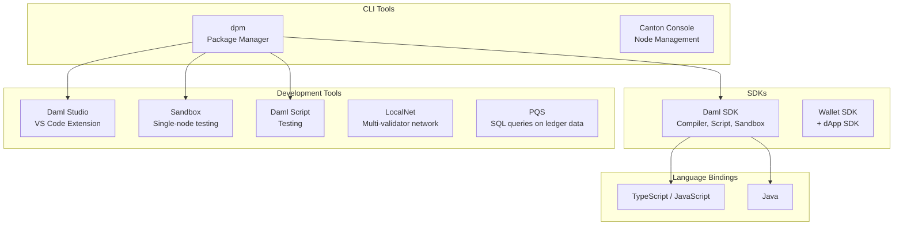

<Warning>
  이 페이지는 팀 리서치를 위한 비공식 한글 번역입니다. [공식 영어 원문](https://docs.canton.network/sdks-tools/overview.md)을 함께 확인하세요.
</Warning>

Canton은 application build, test 및 deploy를 위한 SDK, CLI tool, development environment를 제공합니다. 이 페이지는 각 component의 역할과 관계를 설명합니다.

## Tool Landscape

## SDKs

**Daml SDK**는 기본 development kit입니다. Daml compiler, Daml Script runner, PQS, Canton Sandbox 및 여러 component를 포함하며 `dpm install`로 install하고 manage합니다.

**[Wallet SDK](https://github.com/canton-network/wallet-gateway/tree/main/sdk/wallet-sdk)**는 exchange를 포함한 wallet provider가 Canton Network와 integrate할 때 사용하는 TypeScript library입니다. 별도의 **dApp SDK**는 frontend가 Wallet Gateway에 연결할 때 사용하는 browser-side counterpart를 제공합니다.
두 SDK는 [Integrations](/integrations/overview) 절에서 설명합니다.

## CLI Tools

**dpm**(Daml Package Manager)은 Canton 개발의 주요 command-line entry point입니다. Project initialization, dependency management, compilation, code generation, test 및 sandbox 실행을 처리하며 대부분의 developer workflow는 `dpm` command로 시작합니다.

**Canton Console**은 Canton Node를 직접 manage하는 Scala 기반 REPL입니다. Operator와 advanced developer가 Topology management, Party administration 및 debugging에 사용합니다. 운영 detail은 [Global Synchronizer 절](/global-synchronizer/understand/introduction)을 참조하세요.

**Daml Script**는 Daml contract test language입니다. Daml에서 test script를 `Script ()` value로 작성하고 `dpm test`로 실행합니다.

## Development Tools

**Daml Studio**는 Daml code 작성을 위한 VS Code extension입니다. Syntax highlighting, type checking, inline error diagnostic 및 go-to-definition navigation을 제공하며 `dpm studio`로 실행합니다.

**Sandbox**는 `dpm sandbox`를 통해 local machine에서 single-participant Canton Node를 시작합니다. Full network가 필요하지 않을 때 Daml Script로 작성한 unit test에서 Daml logic을 test하는 데 사용합니다.

**LocalNet**은 [cn-quickstart](https://github.com/digital-asset/cn-quickstart) project의 Docker Compose environment입니다. Local Synchronizer, Canton Coin 및 wallet service와 함께 Super Validator, App Provider, App User 등 여러 Validator를 실행합니다. Multi-party workflow, payment 또는 Splice API interaction을 test할 때 사용합니다.

**PQS**(Participant Query Store)는 ledger data를 PostgreSQL database로 project하여 backend가 standard SQL로 contract state를 query하게 합니다. Validator와 함께 실행되며 ledger와 synchronization을 유지합니다.

## Language Bindings

Code generation은 compile한 Daml package에서 type-safe client library를 생성합니다.

- **TypeScript/JavaScript**: `dpm codegen-js`로 생성합니다. Ledger API에 command를 submit하는 Node.js backend 또는 frontend에서 사용합니다.
- **Java**: `dpm codegen-java`로 생성합니다. gRPC Ledger API client를 사용하는 JVM 기반 backend에서 사용합니다.

Python, Rust 및 Go binding은 community가 maintain하지만 Canton Network가 공식 지원하지는 않습니다.

## Reference Projects

- [cn-quickstart](https://github.com/digital-asset/cn-quickstart): Clone하고 확장할 수 있는 Daml contract, Java backend, React frontend 및 LocalNet 기반 full-stack example입니다.
- [Splice](https://github.com/canton-network/splice): SV app, Scan app, Validator app 및 Wallet을 포함한 Global Synchronizer infrastructure의 reference application입니다.

## Choosing the Right Tool

| 작업 | Tool |
|------|------|
| 새 Daml package 개발 | `dpm new` |
| VS Code에서 Daml edit | `dpm studio`를 통한 Daml Studio |
| Daml contract compile | `dpm build`를 통한 Daml SDK |
| Contract logic test | `dpm test`를 통한 Daml Script |
| 빠른 local test | `dpm sandbox`를 통한 Sandbox |
| Payment를 포함한 multi-validator test | cn-quickstart를 통한 LocalNet |
| SQL로 ledger data query | PQS |
| Canton Node manage | Canton Console |
| TypeScript binding 생성 | `dpm codegen-js` |
| Java binding 생성 | `dpm codegen-java` |
