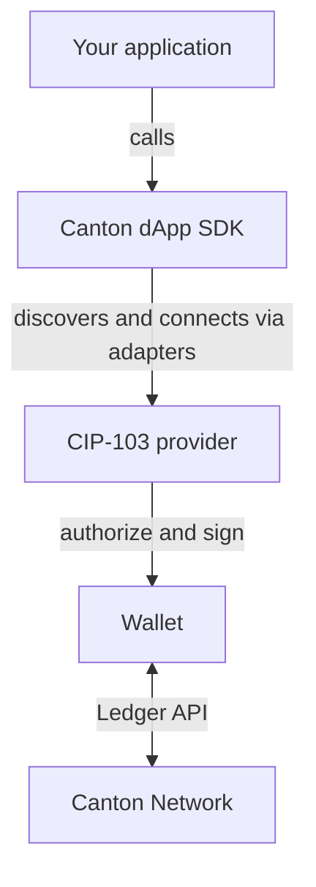

<Warning>
  이 페이지는 팀 리서치를 위한 비공식 한글 번역입니다. [공식 영어 원문](https://docs.canton.network/sdks-tools/sdks/dapp-sdk/overview.md)을 함께 확인하세요.
</Warning>

{/* COPIED_START source="splice-wallet-kernel:docs/dapp-sdk/overview.md@0431c87e" */}

dApp SDK는 web application을 Canton Network의 Wallet에 연결하는 TypeScript library입니다. Frontend에서 Wallet discovery, User 인증, Party 조회, signature 요청, transaction 제출을 수행할 수 있습니다.

SDK를 사용해 다음 작업을 수행할 수 있습니다.

- **사용 가능한 Wallet discovery**: Browser extension, Remote Wallet, WalletConnect를 찾습니다.
- **Session 연결 및 복원**: Wallet picker를 열고 재방문 User를 조용히 다시 연결합니다.
- **User Party 접근**: Account를 나열하고 Primary Party를 읽습니다. Party는 Canton Ledger에서 User의 identity입니다.
- **Signature 요청**: 사람이 읽을 수 있는 message에 서명합니다.
- **Transaction prepare/execute**: User 승인을 받기 위한 Daml command를 제출합니다.
- **JSON Ledger API 호출**: User의 Wallet session을 통해 인증된 request를 proxy합니다.

<Note>
SDK는 framework에 종속되지 않으며 React, Next.js, Vue, Svelte, vanilla TypeScript를 포함한 모든 browser 기반 application에서 동작합니다.
</Note>

## 구성 요소의 연결 방식

Application은 SDK와 통신하고 SDK는 User가 선택한 Wallet과 **CIP-103** Provider Protocol로 통신합니다. Authorization과 signing의 책임은 전적으로 Wallet에 남습니다.

| Layer                | Responsibility                                                                                               |
| -------------------- | ------------------------------------------------------------------------------------------------------------ |
| **dApp SDK**         | 편리한 high-level API이며 dApp의 권장 entry point입니다.                                                     |
| **CIP-103 provider** | EIP-1193 style의 low-level interface입니다. Infrastructure나 기존 Provider integration에서만 직접 사용합니다. |
| **Adapter**          | 공지된 extension, Remote Wallet, WalletConnect 같은 CIP-103 implementation을 찾고 연결합니다.                |
| **Wallet**           | User Party를 보유하고 request를 authorize하며 transaction에 서명합니다.                                     |

Wallet은 다음 두 방식 중 하나로 연결됩니다.

- **Browser Wallet**은 browser extension처럼 User의 browser에서 실행됩니다. dApp에 자신을 announce해 discovery할 수 있게 합니다.
- **Remote Wallet**은 CIP-103 RPC endpoint를 통해 접근하는 server-side Wallet입니다.

Default Wallet picker는 자신을 announce한 Browser Wallet과 SDK의 built-in Remote Wallet list를 보여줍니다. Adapter를 등록하면 WalletConnect나 custom Remote Wallet을 추가할 수 있습니다. [Wallet discovery](/sdks-tools/sdks/dapp-sdk/guides/wallet-discovery)를 참조하세요.

<Note>
SDK는 CIP-103 Provider API 위에 구축됩니다. 대부분의 dApp은 SDK를 사용해야 합니다. Low-level infrastructure를 만들거나 기존 Provider 기반 integration을 적용할 때만 [Provider API](/sdks-tools/sdks/dapp-sdk/reference/provider-api)를 직접 사용하세요.
</Note>

## Quickstart

[Quickstart](/sdks-tools/sdks/dapp-sdk/quickstart)는 high-level SDK만 사용해 SDK 설치, Wallet 연결, User Party 조회, transaction 제출 과정을 안내합니다.

{/* COPIED_END */}
